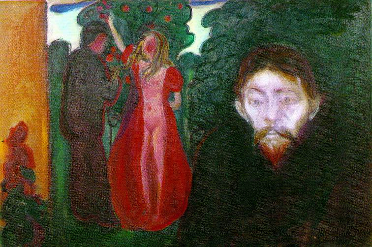

## 基本信息

- 作者：[[爱德华·蒙克 Edvard Munch]]
- 创作年代：1895
- 材质：布面油画 (*not from wiki*)
- 尺寸：未注明
- 现存地：卑尔根 KODE 美术馆 (*not from wiki*)

## 画面与技法

[[爱组画 The Frieze of Life]] 六联画之一，与 [[呐喊 The Scream]] / [[焦虑 Anxiety]] / [[绝望 Despair]] **高度同质**——蒙克情感**符号化、公式化**的努力的延伸（顾衡 070）。

构图：前景一面色青绿、目光直视观者的男子头像（嫉妒者本人，传为波兰作家斯达尼斯瓦夫·普日比谢夫斯基 (*not from wiki*)），背景一对男女演绎"亚当夏娃式"暧昧——主体的情绪不在事件里，而被**外置在主体脸上的颜色与凝视**里。

## 历史背景 (*not from wiki*)

蒙克在 1890s 中期与柏林波兰文学圈密切交往，"嫉妒"母题反复出现，与他自身对达格妮·尤尔 (Dagny Juel) 的感情纠葛有关。

## 图片清单

| 编号 | 出自 | 描述 |
|---|---|---|
| 01 | [[070｜蒙克1：表现主义的先行者经历了什么？]] | 前景青绿色嫉妒者头像 + 背景男女 |

## 出现在

- [[070｜蒙克1：表现主义的先行者经历了什么？]]
