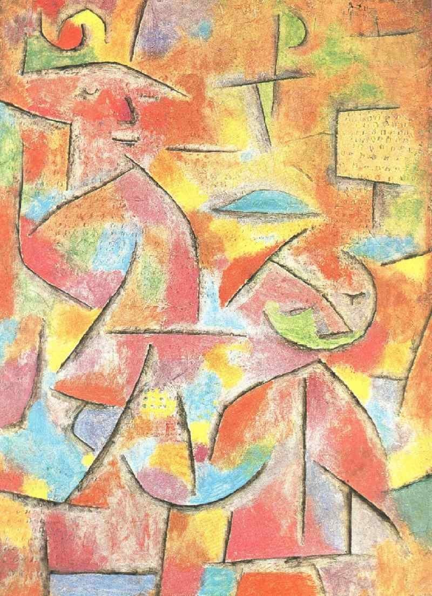

## 基本信息

- 作者：[[克利 Paul Klee]]
- 创作年代：1940
- 材质：油画或粉彩 (*not from wiki*)
- 现存地：(*not from wiki*)

## 画面与技法

[[克利 Paul Klee]] 1940 年作。克利去世前夕的作品之一，与 [[苦乐岛 Bittersweet Island]]、[[蓝色大衣 Blue Coat]]、[[中毒 Intoxication]]、[[死与火 Death and Fire]] 同属晚期厚黑线条阶段。

## 历史背景

(*not from wiki*) 1940 年 6 月 29 日克利去世于瑞士洛迦诺附近；本年其手部因 [[硬皮症 Scleroderma]] 严重僵硬，画笔反而变得更粗砺有力。

## 图片清单

| 编号 | 出自 | 描述 |
|---|---|---|
| 01 | [[085｜克利：他为什么模仿小孩子画画？]] | 童稚视角的两人构图 |

## 出现在

- [[085｜克利：他为什么模仿小孩子画画？]]
