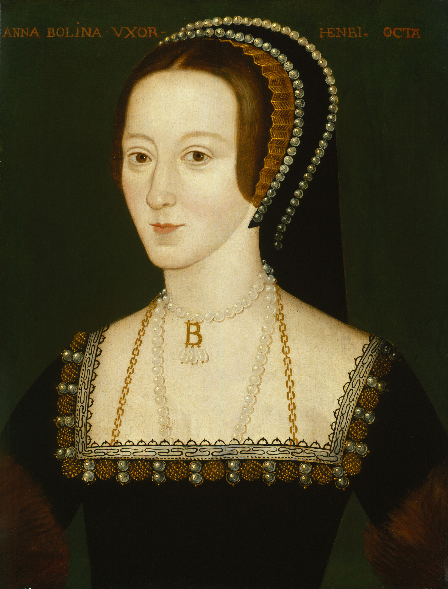

## 基本信息

- 作者：佚名 (Anonymous) —— 顾衡 021 引"一个佚名画家"
- 创作年代：1533–1536 (顾衡引 "1533-1536")
- 材质：木板油彩 (*not from wiki*)
- 尺寸：常见版本 54.3 × 41.6 cm (*not from wiki*)
- 现存地：常见版本藏于 National Portrait Gallery, London (NPG 668)，被认为是 16 世纪晚期对一幅可能源自 1533–1536 时期原作的复制 (*not from wiki*)

## 画面与技法

[[亨利八世 Henry VIII of England]] 第二任王后 **安妮·博林 Anne Boleyn** 半身像——头戴黑色法式头饰、白色衣领 + 黄金"B"字项链。

**意义**：与 [[安妮·博林像素描 (荷尔拜因) Sketch of Anne Boleyn]] 形成"宫廷美化 vs 写实素描"的对照——顾衡用它作为"画家没操守"的极端案例：

> 但是我们看一个佚名画家画的安妮·博林像。**简直是美若天仙**。画家没操守起来，**比现在的美图秀秀可厉害多了**。

## 历史背景

(*not from wiki*) 1536 安妮·博林被处死后，亨利八世下令销毁她的所有正式油画肖像。本作（及其他类似作品）多被认为是**晚于安妮·博林死后**所作的"纪念性 / 美化"版本——伊丽莎白一世（安妮的女儿）在位时 (1558–1603) 对母亲的重新评价，催生了一批宫廷外的"美化版"流通。

## 图片清单

| 编号 | 出自 | 描述 |
|---|---|---|
| 01 | [[021｜荷尔拜因：为什么要画那么多肖像画？]] | 整体图——"美图秀秀"的安妮·博林 |

## 出现在

- [[021｜荷尔拜因：为什么要画那么多肖像画？]]
