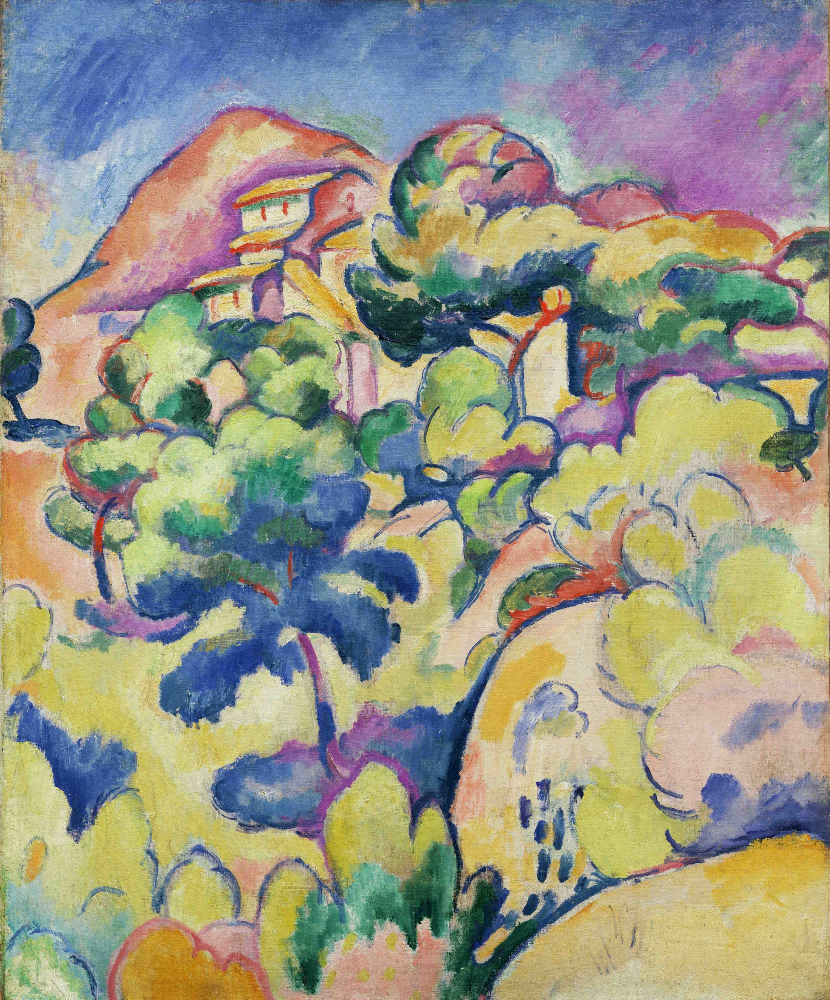

## 基本信息

- 作者：[[勃拉克 Georges Braque]]
- 创作年代：1906
- 材质：布面油画 (*not from wiki*)
- 尺寸：年代不详 (*not from wiki*)
- 现存地：纽约古根海姆博物馆 Solomon R. Guggenheim Museum (*not from wiki*)

## 画面与技法

[[勃拉克 Georges Braque]] [[野兽派 Fauvism]] 时期作品，与《[[希欧达的风景 Landscape at La Ciotat]]》同列——

- 顾衡（066）用本作举证：勃拉克尽管在野兽派 Le Havre 小组中（与 [[杜菲 Raoul Dufy]]、[[弗里兹 Othon Friesz]] 同乡），但其作品**比同侪更多塞尚的元素**——画面结构有几何化倾向、色彩克制。
- 这种底色为勃拉克 1907 年迅速理解并加入 [[毕加索 Pablo Picasso]] 的立体主义实验提供了基础。

## 历史背景 (*not from wiki*)

- 1906 年夏天勃拉克在比利时安特卫普附近作画——彼时他正与 [[弗里兹 Othon Friesz]] 同行。
- 1906 巴黎秋季沙龙是野兽派的高峰；勃拉克此期作品已经显现出后野兽派的迹象。

## 图片清单

| 编号 | 出自 | 描述 |
|---|---|---|
| 01 | [[066｜毕加索3：什么是分析立体主义？]] | 全图——勃拉克野兽派时期的塞尚倾向 |

## 出现在

- [[066｜毕加索3：什么是分析立体主义？]] —— 勃拉克野兽派 → 立体主义转向的前置证据
