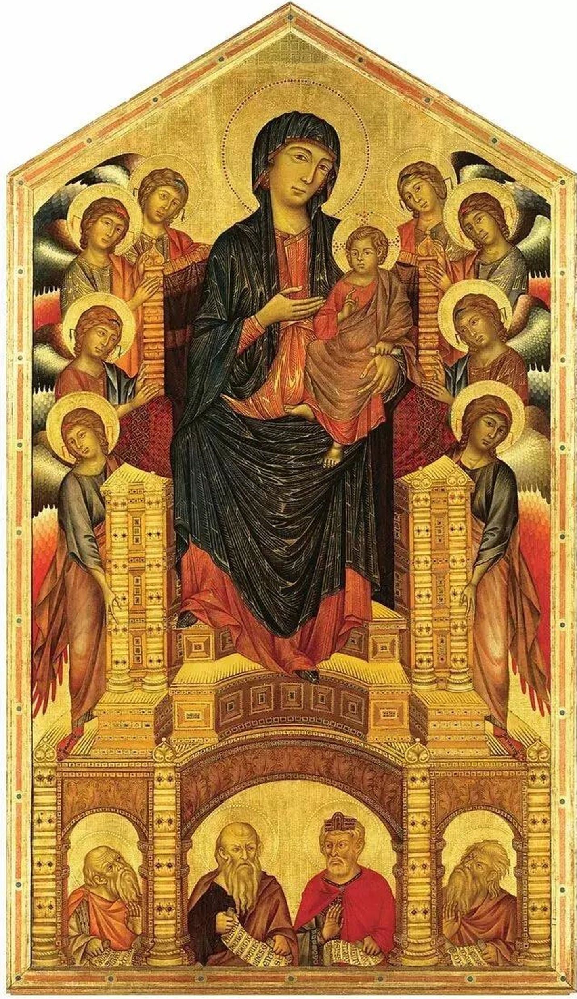

## 基本信息

- 作者：[[契马布埃 Cimabue]]
- 创作年代：约 1280–1285 (*not from wiki*)
- 材质：木板蛋彩、金底
- 尺寸：384 × 223 cm (*not from wiki*)
- 现存地：佛罗伦萨乌菲齐美术馆 (Galleria degli Uffizi)；原置佛罗伦萨圣三一教堂主祭坛 (*not from wiki*)

## 画面与技法

中央正面坐着的圣母怀抱圣子；八位天使分两列侍立；底部宝座下方四位旧约先知。

**关键创新**：

- 金底、光环、长鼻小嘴的拜占庭程式仍在；
- 但**画面下方四位先知**——契马布埃用色调明暗给他们塑造了**真实的体积感**——基督教绘画 1000 年来第一次。
- 圣母与宝座的空间关系仍模糊，但宝座本身有透视尝试。

顾衡评：这是"最先迈开的一小步，效果上和以后的达·芬奇拉斐尔没法比，但是非常重要的一步。"

## 历史背景

(*not from wiki*) 与 杜乔《Madonna Rucellai》(1285)、乔托《Ognissanti Madonna》(1310) 并称"乌菲齐三圣母"——同一展厅展出，是 13 世纪末意大利哥特绘画师徒三代的并置展示，最能看出从程式向写实的演变。

## 图片清单

| 编号 | 出自 | 描述 |
|---|---|---|
| 01 | [[006｜哥特艺术2：为什么在意大利发生了分化？]] | 整体图 |

## 出现在

- [[006｜哥特艺术2：为什么在意大利发生了分化？]]
