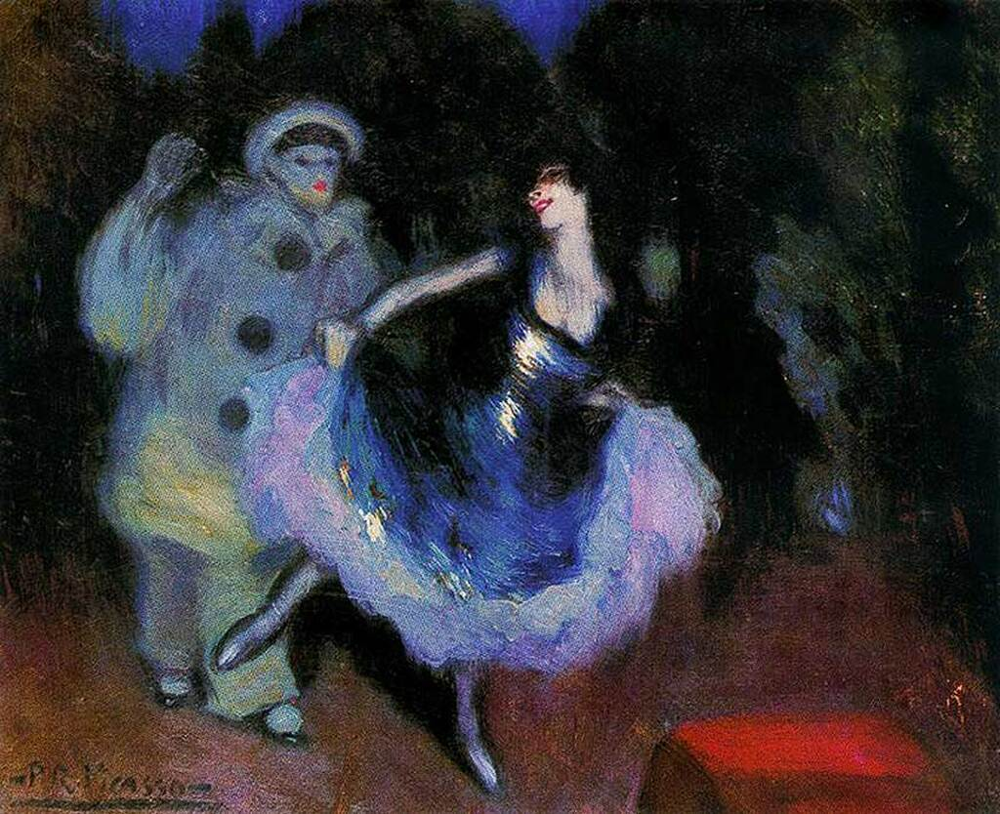

## 基本信息

- 作者：[[毕加索 Pablo Picasso]]
- 创作年代：1900
- 材质：布面油画 (*not from wiki*)
- 尺寸：年代不详 (*not from wiki*)
- 现存地：私人收藏 (*not from wiki*)

## 画面与技法

毕加索 [[蓝色时期 Blue Period]] 初期"兼收并蓄"阶段的作品——本讲判定 **与 [[劳特累克 Henri de Toulouse-Lautrec]] 如出一辙**：剧场夜场题材（取材自意大利即兴喜剧 *commedia dell'arte* 的固定角色 Pierrot 与 Colombina）、海报式的扁平化构图、轮廓线-色域分离的处理——都是劳特累克 1890s 巴黎夜场画的核心语汇。

## 历史背景 (*not from wiki*)

- 创作于毕加索抵达巴黎的同年（1900）——也是劳特累克去世前一年（劳特累克 1901 年逝世）。
- Pierrot / Colombina / Harlequin 等小丑题材会被毕加索带入玫瑰红时期，发展为身份认同符号。

## 图片清单

| 编号 | 出自 | 描述 |
|---|---|---|
| 01 | [[064｜毕加索1：如何理解"蓝色时期"和"玫瑰红时期"？]] | 整幅画面 |

## 出现在

- [[064｜毕加索1：如何理解"蓝色时期"和"玫瑰红时期"？]]
