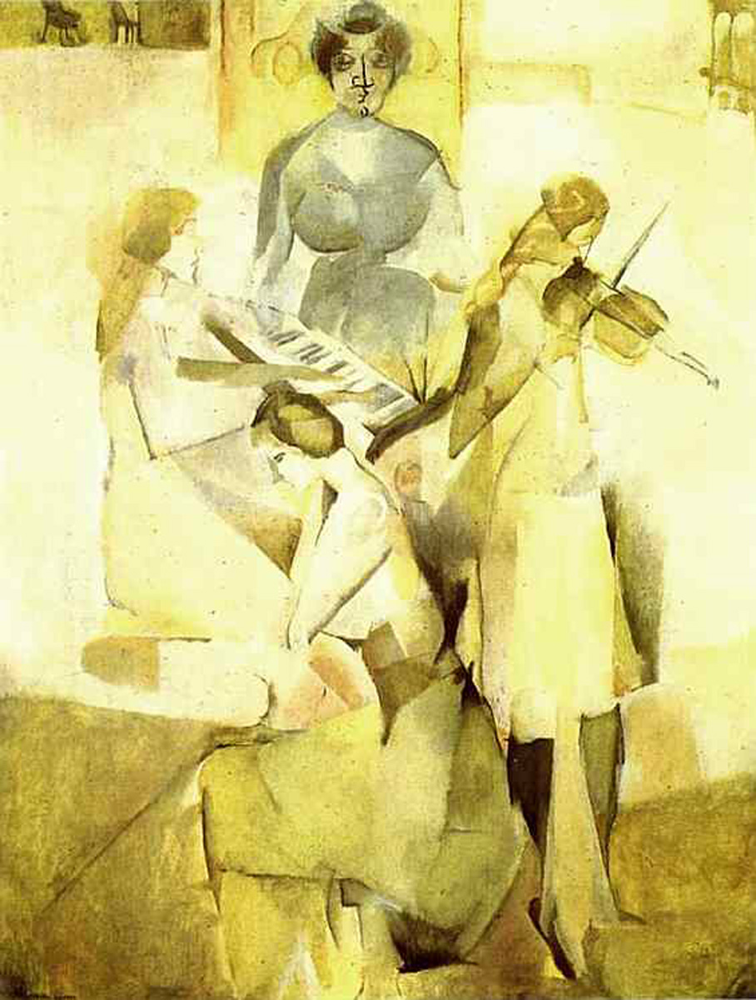

## 基本信息

- 作者：[[杜尚 Marcel Duchamp]]
- 创作年代：1911
- 材质：油画 (*not from wiki*)
- 尺寸：约 145 × 113 cm (*not from wiki*)
- 现存地：费城美术馆 Philadelphia Museum of Art (*not from wiki*)

## 画面与技法

本讲（088）作为杜尚 1911 年"**[[分析立体主义 Analytical Cubism]] 期**"代表出场——与《[[苏珊娜肖像 (杜尚) Portrait of Suzanne Duchamp]]》《[[棋手 (杜尚) Portrait of Chess Players]]》并列，"都是妥妥的分析立体主义风"。题材是杜尚家庭中三位姐妹与母亲的合奏 (*not from wiki*：母亲与三女姐妹的音乐场景，呼应母系家学传统——母亲耳濡目染于外祖父 [[尼科尔 Émile Frédéric Nicolle]] 的"绘画和音乐"修养)。

## 历史背景

(*not from wiki*) 杜尚加入 [[皮托集团 Puteaux Group]] 后的代表作品之一；体现了从塞尚期向分析立体主义的过渡。

## 图片清单

| 编号 | 出自 | 描述 |
|---|---|---|
| 01 | [[088｜杜尚1：他"好好画画"是什么样子的？]] | 整体图——母亲与三姐妹的音乐合奏 |

## 出现在

- [[088｜杜尚1：他"好好画画"是什么样子的？]]
