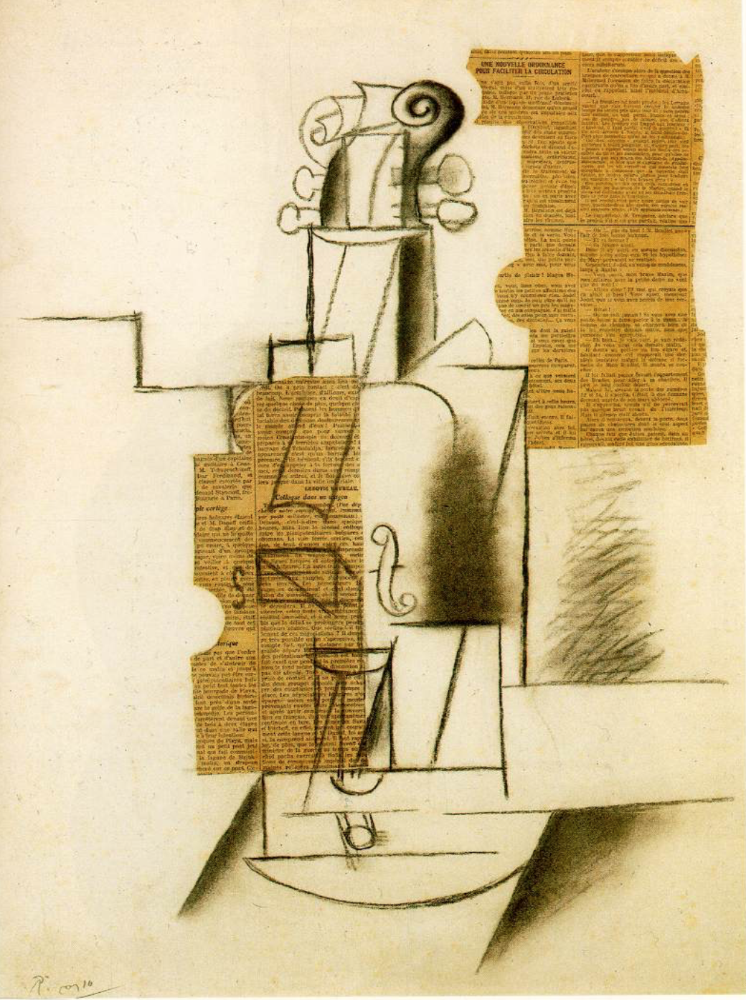

## 基本信息

- 作者：[[毕加索 Pablo Picasso]]
- 创作年代：1910
- 材质：(*not from wiki*) 布面油画
- 尺寸：年代不详
- 现存地：年代不详

## 画面与技法

[[分析立体主义 Analytic Cubism]] 与 [[综合立体主义 Synthetic Cubism]] 过渡期作品；顾衡 067 与 1912 版小提琴并置，演示**"保留琴头与F孔"作为暗示**的策略——但本幅尚处于更接近分析立体主义的几何切面阶段。

## 历史背景

(*not from wiki*) 小提琴是毕加索与 [[勃拉克 Georges Braque]] 立体主义阶段最频繁出现的母题，因为乐器的形态富含曲面与孔洞，便于做几何分解。

## 图片清单

| 编号 | 出自 | 描述 |
|---|---|---|
| 01 | [[067｜毕加索4：什么是综合立体主义？]] | 整体图 |

## 出现在

- [[067｜毕加索4：什么是综合立体主义？]]
