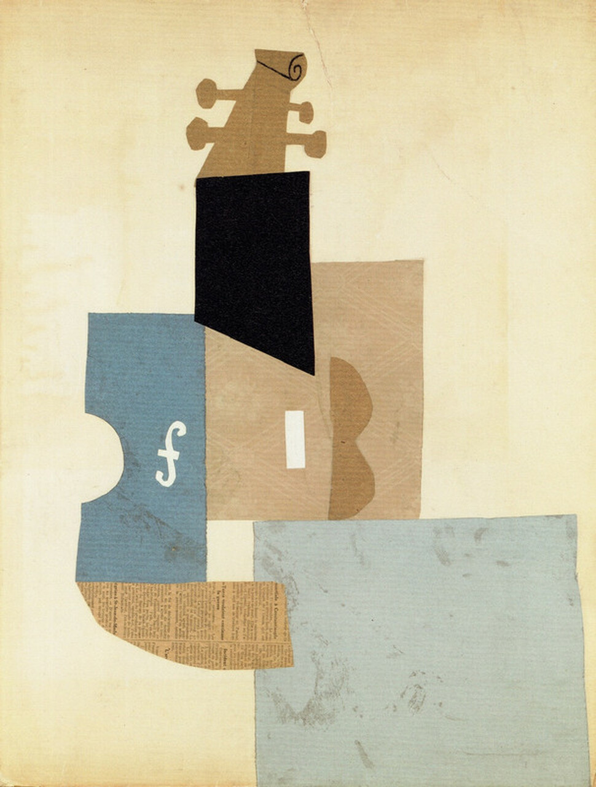

## 基本信息

- 作者：[[毕加索 Pablo Picasso]]
- 创作年代：1912
- 材质：(*not from wiki*) 拼贴、纸本
- 尺寸：年代不详
- 现存地：年代不详

## 画面与技法

[[综合立体主义 Synthetic Cubism]] 时期作品；**琴头**和**F孔**被刻意保留作为暗示，提示观者画面表现的是一把小提琴——这是顾衡 067 解释综合立体主义"宏观抽象、微观要给足够暗示"的核心样本。

## 历史背景

(*not from wiki*) 1912 年是毕加索与 [[勃拉克 Georges Braque]] 共同发明 [[拼贴 Collage]] 与 papier collé（贴纸画）的关键年份；小提琴在这一阶段反复出现，成为综合立体主义最常见的母题之一。

## 图片清单

| 编号 | 出自 | 描述 |
|---|---|---|
| 01 | [[067｜毕加索4：什么是综合立体主义？]] | 整体图（保留琴头与F孔） |

## 出现在

- [[067｜毕加索4：什么是综合立体主义？]]
