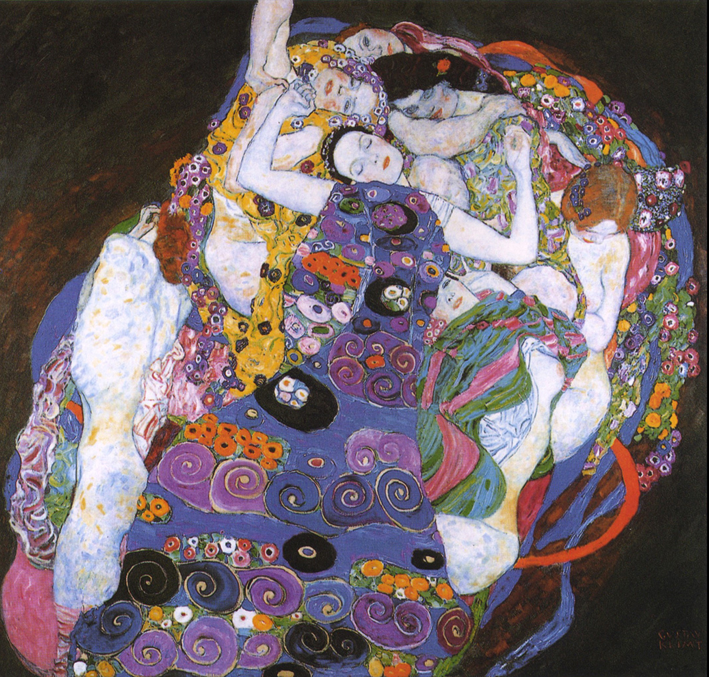

## 基本信息

- 作者：[[克里姆特 Gustav Klimt]]
- 创作年代：1913
- 材质：（*not from wiki*）布面油画
- 尺寸：（*not from wiki*）190 × 200 cm
- 现存地：（*not from wiki*）布拉格国家美术馆 National Gallery in Prague

## 画面与技法

[[克里姆特 Gustav Klimt]] **装饰性**风格代表作之一——七个不同姿态的女子层叠组合在一片繁密花纹装饰中（*not from wiki*）。

顾衡 073 用本作品支撑其论点："一幅画大家觉得好看，竟然成了罪过。"——同时代艺术家批评克里姆特"谄媚庸俗的资产阶级"，顾衡反驳："克里姆特的画真好看，真好看，这怎么就不行了呢？"

## 历史背景 (*not from wiki*)

属于克里姆特"金色时期"之后的"绚烂期"代表——金箔淡出，代之以更明亮的色彩堆叠。

## 图片清单

| 编号 | 出自 | 描述 |
|---|---|---|
| 01 | [[073｜克里姆特：什么是维也纳分离派？]] | 少女全图 |

## 出现在

- [[073｜克里姆特：什么是维也纳分离派？]]
