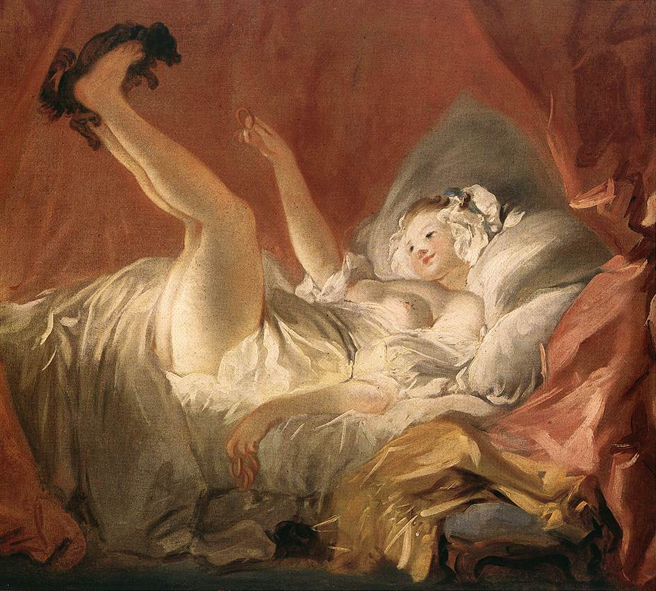

## 基本信息

- 作者：[[弗拉戈纳尔 Jean-Honoré Fragonard]]
- 创作年代：1770
- 材质：布面油画 (*not from wiki*)
- 尺寸：约 89 × 70 cm (*not from wiki*)
- 现存地：慕尼黑老绘画陈列馆 Alte Pinakothek, Munich (*not from wiki*)

## 画面与技法

一位年轻少女仰卧在凌乱的床上，**用双脚向上托起一只小狗**让它在腿间起舞——一幕轻佻又孩子气的私密场景。少女裙摆翻起、双腿裸露，但表情天真愉悦。床帐与床单的褶皱、被翻起的薄纱、少女皮肤的粉白质感——展示弗拉戈纳尔擅长的"精细与质感"。

## 顾衡解读（029）

**029 的辩护样本**——用美国最高法院判《尤利西斯》的"上流 vs 下流"标准看：

> 我们感觉得到，弗拉戈纳尔的心思是放在怎么表现少女身体的美好上，强调的是精细和质感，他要表现的，恰恰是**少女的纯洁无瑕**。

属"上流"——为表达对女性身体之美的赞赏，而非挑逗动物本能。即洛可可"**注重过程，轻视结果**"的情爱观在裸体题材上的健康呈现：画少女就仅仅是画少女，与色情无关。

## 历史背景

(*not from wiki*) 又名 **《La Gimblette》**——一种环形小饼的名字，借指少女抛给狗的物件。题材源自洛可可宫廷沙龙的私密观赏画（boudoir piece），尺寸不大、专为贵族卧室或私室定制。

## 图片清单

| 编号 | 出自 | 描述 |
|---|---|---|
| 01 | [[029｜洛可可为什么那么香艳？]] | 整体图 |

## 出现在

- [[029｜洛可可为什么那么香艳？]]
