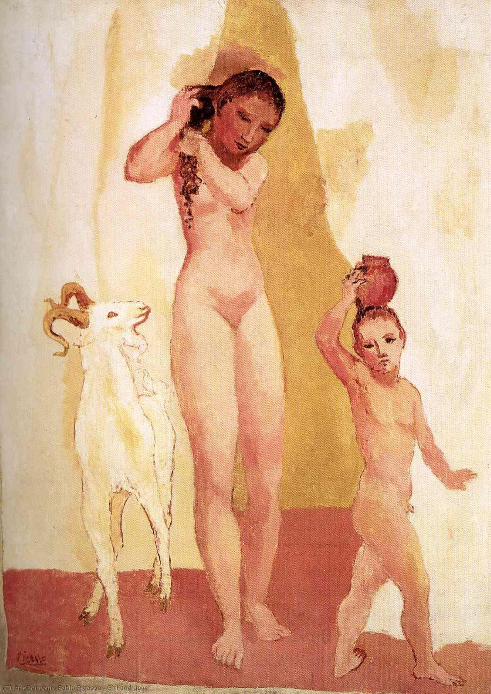

## 基本信息

- 作者：[[毕加索 Pablo Picasso]]
- 创作年代：1906
- 材质：油彩，画布 (*not from wiki*)
- 尺寸：(*not from wiki*)
- 现存地：(*not from wiki*)

## 画面与技法

[[黑人时期 African Period (Picasso)|黑人时期]] **几何化倾向萌芽期**的样本之一，与《[[两个裸女 Two Nudes (Picasso 1906)|两个裸女]]》并列——女性胴体的各部位开始出现几何化倾向，肢体简化为圆柱与球体组合。

色调延续 [[064｜毕加索1：如何理解"蓝色时期"和"玫瑰红时期"？|玫瑰红时期]] 的赭、土黄、肉粉系——构图静谧、近乎牧歌式，但造型已经几何化。

## 历史背景 (*not from wiki*)

属于 1906 年夏天毕加索在西班牙 Gósol 村期间创作的牧歌-几何化系列，是从玫瑰红时期向黑人时期的过渡产物。

## 图片清单

| 编号 | 出自 | 描述 |
|---|---|---|
| 01 | [[065｜毕加索2：如何理解"黑人时期"？]] | 全图——几何化倾向萌芽样本之一 |

## 出现在

- [[065｜毕加索2：如何理解"黑人时期"？]] —— [[黑人时期 African Period (Picasso)|黑人时期]] 几何化萌芽样本之一
