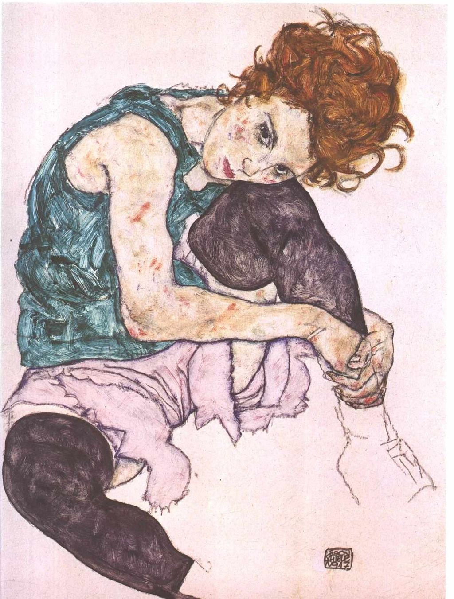

## 基本信息

- **作者**：[[席勒 Egon Schiele]]
- **创作年代**：1917
- **材质**：水彩 / 黑色蜡笔 / 纸 (*not from wiki*)
- **现存地**：布拉格国家美术馆 Národní galerie Praha (*not from wiki*)

## 画面与技法

席勒的妻子爱迪斯·哈姆斯（Edith Harms）的肖像——绿色衣裙、屈膝侧坐、面容沉静。与同期的沃莉系列对比，画中爱迪斯**没有沃莉肖像里的情色张力**，更趋向布尔乔亚的内敛体面（顾衡 075）。

## 历史背景 (*not from wiki*)

爱迪斯出身维也纳布尔乔亚家庭。1915 年席勒抛弃沃莉迎娶爱迪斯，1918 年两人先后死于**西班牙流感**——爱迪斯去世时怀有六个月身孕。

## 图片清单

| 编号 | 出自 | 描述 |
|---|---|---|
| 01 | [[075｜席勒2：为什么他是"最表现主义"的画家？]] | 绿裙屈膝坐 |

## 出现在

- [[075｜席勒2：为什么他是"最表现主义"的画家？]]
