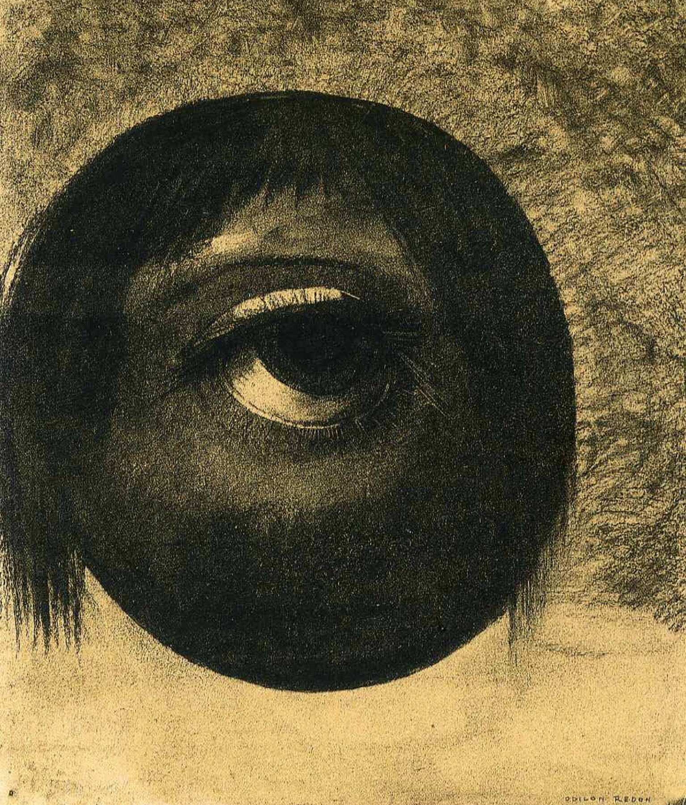

## 基本信息

- 作者：[[雷东 Odilon Redon]]
- 创作年代：1883
- 材质：年代不详（雷东早期 noirs，炭笔 / 石版画）
- 尺寸：年代不详
- 现存地：未注明

## 画面与技法

雷东早期黑白阶段的"幻象"母题作品，顾衡 051 用作雷东 "**艺术是想象**" 主张的图像凭证之一。

## 历史背景 (*not from wiki*)

雷东自小被寄养于乡下、敏感孤独，"喜欢寻找阴暗的地方"——这种童年气质直接喂养了他成年后大量的幻象 / 梦境母题。

## 图片清单

| 编号 | 出自 | 描述 |
|---|---|---|
| 01 | [[051｜雷东：怪诞是不是象征主义的方向？]] | 雷东 1883 |

## 出现在

- [[051｜雷东：怪诞是不是象征主义的方向？]]
