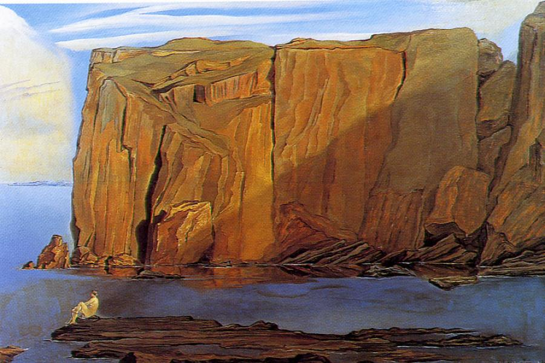

## 基本信息

- 作者：[[达利 Salvador Dalí]]
- 创作年代：1926
- 材质：布面油画 (*not from wiki*)
- 尺寸：年代不详
- 现存地：(*not from wiki*) 私人收藏

## 画面与技法

094 中与《[[窗边的少女 (达利) Girl at the Window]]》并列，作为达利**学院派阶段**绘画功底扎实的另一样本登场。顾衡："画得非常好。"

(*not from wiki*) 加泰罗尼亚海岸（Cap de Creus）裸体女性慵懒侧卧岩石之上的写实油画——干燥锋利的西班牙阳光、岩石质感、人体明暗解剖都体现达利学院派训练的水准。

## 历史背景 (*not from wiki*)

1926 年同年达利在学院期末考试中被开除（"你们可算是问着了！这个问题我的知识比你们三个加起来还多"——094）。本作即学院后期作品。

## 图片清单

| 编号 | 出自 | 描述 |
|---|---|---|
| 01 | [[094｜达利：为什么他画的是"伪装的梦"？]] | 全图 |

## 出现在

- [[094｜达利：为什么他画的是"伪装的梦"？]]
