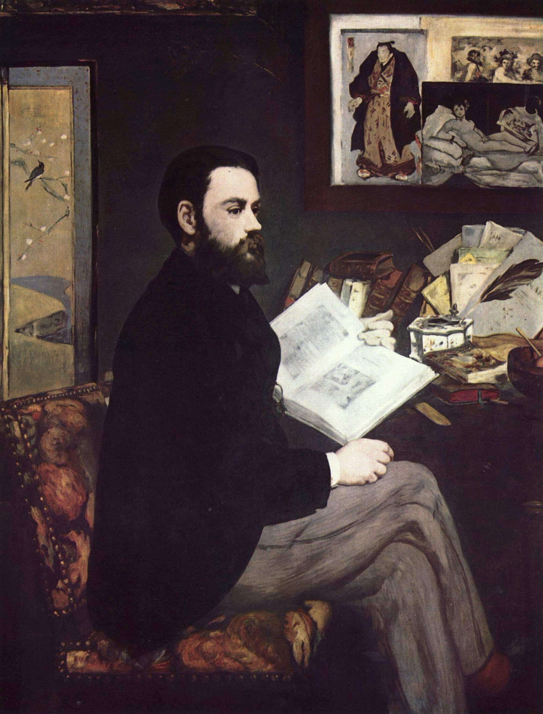

## 基本信息

- 作者：[[马奈 Édouard Manet]]
- 创作年代：1868
- 材质：布面油画 (*not from wiki*)
- 尺寸：146.5 × 114 cm (*not from wiki*)
- 现存地：奥赛博物馆 Musée d'Orsay, Paris (*not from wiki*)

## 画面与技法

043 顾衡借本作论"**马奈在媒体也有朋友 (左拉)、还细心地植入了自己的小广告**"——画面书桌右上方钉着马奈作品《[[奥林匹亚 Olympia]]》的小型复制图，旁边并置 [[委拉斯贵支 Velázquez]]《酒神巴克斯》的版画和日本武士图——马奈把自己的西班牙渊源、日本主义嗜好、与左拉的同盟关系**全部植入到一张肖像里**，是 19 世纪艺术家与文人媒体盟友合作的标本。

043 顾衡用本作作为雷诺阿-夏庞蒂埃成功对照组的一部分——马奈与左拉的同盟未能及时变现：**左拉的声望要到 1898 年德雷福斯案件后才如日中天，而马奈 1883 年已因梅毒并发症去世**。

## 历史背景 (*not from wiki*)

1866–1867 年间左拉在《大事件报》连发文章为马奈辩护，特别是力挺当时被骂得最惨的《[[奥林匹亚 Olympia]]》。本画 1868 年沙龙展出——是马奈以肖像回赠左拉的"画板上的致敬"。

## 图片清单

| 编号 | 出自 | 描述 |
|---|---|---|
| 01 | [[043｜雷诺阿：妥协如何造就大师？]] | 全图，左拉坐姿肖像，背景墙面拼贴 |

## 出现在

- [[043｜雷诺阿：妥协如何造就大师？]]
