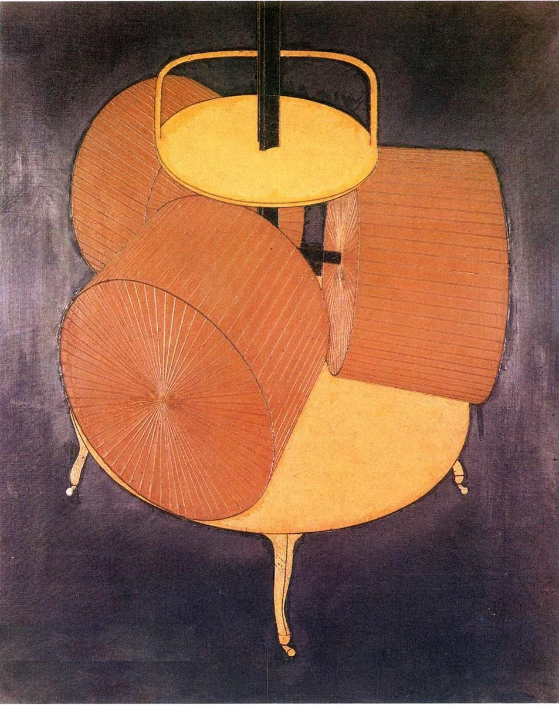

## 基本信息

- 作者：[[杜尚 Marcel Duchamp]]
- 创作年代：1914（亦有 1913 / 1914 两版本） (*not from wiki*)
- 材质：布面油画 (*not from wiki*)
- 尺寸：约 65 × 54 cm (No. 1)；约 65 × 54 cm (No. 2) (*not from wiki*)
- 现存地：费城美术馆 (Philadelphia Museum of Art) (*not from wiki*)

## 画面与技法

杜尚《大玻璃》([[新娘甚至被单身汉剥光了衣服 The Bride Stripped Bare by Her Bachelors]]) 下层装置的关键部件——一台带三只滚筒的研磨机，独立成画。

形象来自杜尚少年时在鲁昂 Gamelin 巧克力店橱窗看到的真实工业研磨机；他在《大玻璃》笔记里把它定位成"光棍机械"中的核心齿轮——把光棍的性能量"研磨/转化"为电能，进而驱动剥光新娘衣服的程序。

形式上：**机械式平面化、近似制图式的线性结构**，标志着杜尚已完全脱离 [[分析立体主义 Analytical Cubism]] 的笔触感，转向冷漠、技术性的图绘风格——为后来的 [[现成品 Readymade]] 美学打基础。(*not from wiki*)

## 历史背景

(*not from wiki*) 与 [[三个标准的终止 3 Standard Stoppages]]、[[自行车轮 (杜尚) Bicycle Wheel]] 等一道，是杜尚 1913–1914 年"放弃绘画 / 走向反艺术"的关键过渡期作品。No.2 版本（1914）使用了**缝合线**直接缝在画布上来表示机械结构线——进一步剥离绘画手艺感。

## 图片清单

| 编号 | 出自 | 描述 |
|---|---|---|
| 01 | [[090｜杜尚3：他为什么要送一个小便器去参展？]] | 单幅画——三滚筒研磨机正视图 |

## 出现在

- [[090｜杜尚3：他为什么要送一个小便器去参展？]]
