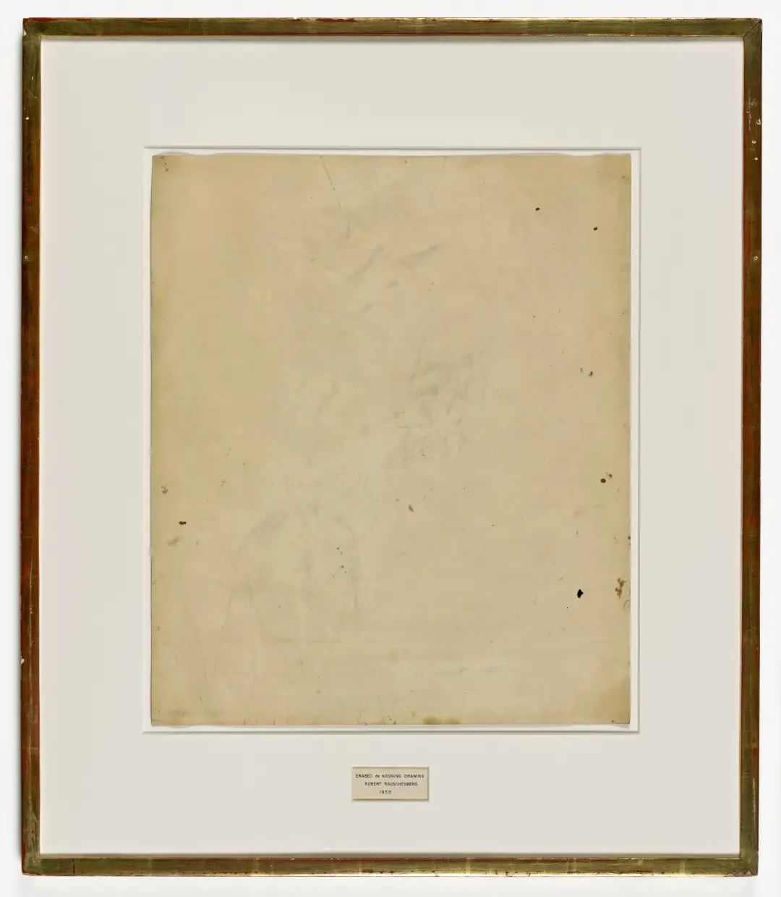

## 基本信息

- 作者：[[劳申伯格 Robert Rauschenberg]]
- 创作年代：1953
- 材质：纸面被擦除的素描痕迹、装裱在镀金画框内（*not from wiki*）
- 尺寸：（*not from wiki*）64.1 × 55.2 cm
- 现存地：（*not from wiki*）旧金山现代艺术博物馆 SFMOMA

## 画面与技法

画面上几乎什么都没有——只剩极淡的擦拭残痕和铅笔印。但**作品的真正内容**在画框下方的标牌：

> ERASED de KOONING DRAWING / ROBERT RAUSCHENBERG / 1953

顾衡 098 转述创作过程：

> 早在 1953 年，[[劳申伯格 Robert Rauschenberg]] 就向 [[德·库宁 Willem de Kooning]] 索要了一件作品，**花了两个月的时间用橡皮把它擦掉**，取名为《已擦除的德·库宁的作品》，用这种方式，表达了对 [[抽象表现主义 Abstract Expressionism]] 的不屑和不满。

## 历史背景 (*not from wiki*)

- 据说德·库宁在听明白来意后选了一幅自己最得意、用了碳条 + 油画棒 + 铅笔多种媒材的作品给劳申伯格——以确保"难擦"。
- 劳申伯格用了约 40 块橡皮才擦干净。
- 作品被普遍视为艺术史上首次以"取消"作为创造行为本身的明确案例——杜尚 [[创造性行为 Creative Act]] 路线的延续，但更冷酷：直接擦掉前辈大师的手迹。

## 图片清单

| 编号 | 出自 | 描述 |
|---|---|---|
| 01 | [[098｜波普艺术：流行文化如何成为艺术？]] | 作品全图 / 标牌可见 |

## 出现在

- [[098｜波普艺术：流行文化如何成为艺术？]]
