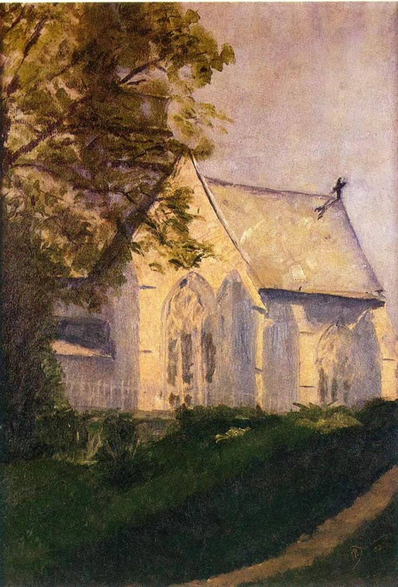

## 基本信息

- 作者：[[杜尚 Marcel Duchamp]]
- 创作年代：1902
- 材质：油画 (*not from wiki*)
- 尺寸：约 61 × 42 cm (*not from wiki*)
- 现存地：费城美术馆 Philadelphia Museum of Art (*not from wiki*)

## 画面与技法

杜尚 15 岁中学时代作品。本讲（088）作为"中规中矩的[[印象派 Impressionism]]风格"代表与《[[布兰维尔的风景 Landscape at Blainville]]》并列出场，显现"很好的基本功"。

## 历史背景

(*not from wiki*) 杜尚现存最早期作品之一；与《布兰维尔的风景》并列见证他鲁昂高乃依中学（柯罗、莫泊桑、福楼拜母校）时期画画"显现出很好的基本功"——同年杜尚还获了数学竞赛冠军 + 鲁昂"艺术协会"的画画天份奖章。

## 图片清单

| 编号 | 出自 | 描述 |
|---|---|---|
| 01 | [[088｜杜尚1：他"好好画画"是什么样子的？]] | 整体图——中学时期印象派教堂风景 |

## 出现在

- [[088｜杜尚1：他"好好画画"是什么样子的？]]
