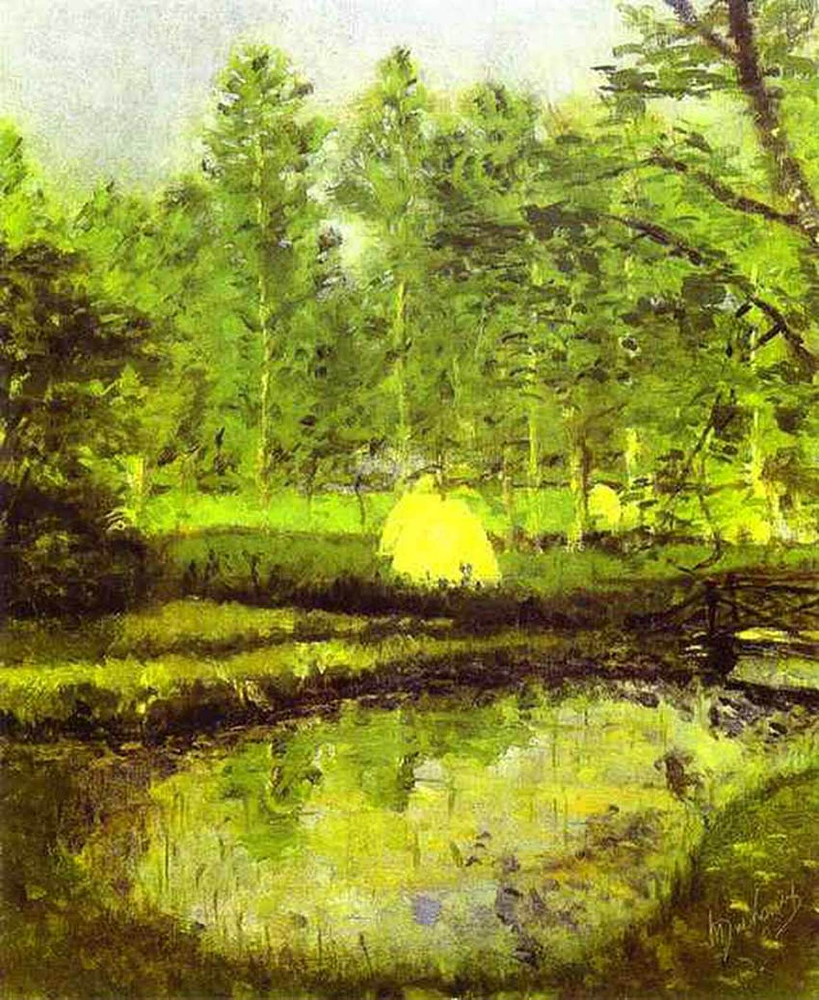

## 基本信息

- 作者：[[杜尚 Marcel Duchamp]]
- 创作年代：1902
- 材质：油画 (*not from wiki*)
- 尺寸：约 61 × 50 cm (*not from wiki*)
- 现存地：未知 / 私人收藏 (*not from wiki*)

## 画面与技法

杜尚中学时代（15 岁）的作品。本讲（088）作为"中规中矩的[[印象派 Impressionism]]风格"代表出场——基本功扎实但"谈不上多出彩"。布兰维尔即杜尚出生地——法国鲁昂以北 19 公里的小镇。

## 历史背景

(*not from wiki*) 杜尚现存最早期作品之一；与同年的《[[布兰维尔的教堂 Church at Blainville]]》一起属于他鲁昂高乃依中学时期的习作——同年他获鲁昂"艺术协会"的奖章（"只授予学校中最有绘画天份的孩子"）。

## 图片清单

| 编号 | 出自 | 描述 |
|---|---|---|
| 01 | [[088｜杜尚1：他"好好画画"是什么样子的？]] | 整体图——中规中矩印象派风景 |

## 出现在

- [[088｜杜尚1：他"好好画画"是什么样子的？]]
