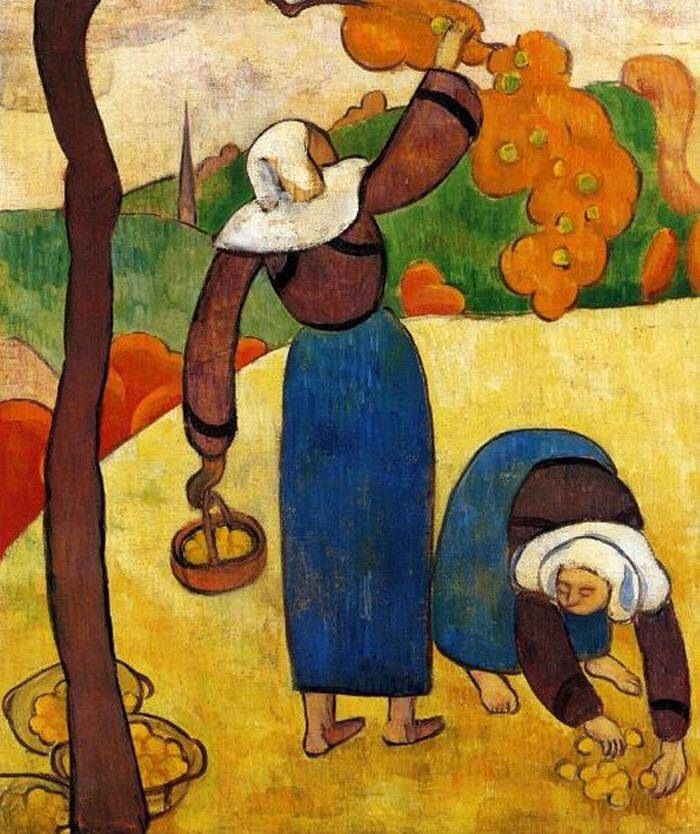

## 基本信息

- 作者: [[贝尔纳 Émile Bernard]]
- 创作年代: 1888 (*not from wiki*) — raw 标 1889
- 材质: 布面油画 (*not from wiki*)
- 尺寸: 年代不详
- 现存地: (*not from wiki*) 私人收藏（待核）

> 注：raw caption 标 "1889"，但本画通常被定为 **1888 年作**——[[贝尔纳 Émile Bernard]]在阿旺桥见到[[高更 Paul Gauguin]]之前不久完成，恰好是把"景泰蓝派"理念带到高更面前的标本。本 wiki 保留 raw 注的"1889"作为参考。

## 画面与技法

景泰蓝派 ([[景泰蓝派 Cloisonnism]]) 的典型样本——顾衡 055 描述："**用封闭的线条勾勒出一个个形状，然后在其中平涂上各种颜色。这种方法非常像咱们中国的景泰蓝工艺，所以就被称为景泰蓝派绘画。**"该画与同时期安奎丹的尝试，构成贝尔纳带给高更的"激进新法"的第一手示范。

## 历史背景 (*not from wiki*)

1888-1889 间贝尔纳赴阿旺桥拜访高更，向后者详细介绍象征主义理论及景泰蓝派进展，直接催化了高更的同年画作《[[雅各与天使搏斗 Vision after the Sermon|雅各与天使搏斗]]》——高更从此倒向[[象征主义 Symbolism]]。

## 图片清单

| 编号 | 出自 lecture | 描述 |
|---|---|---|
| 01 | [[055｜高更1：为什么从印象派走向象征主义？]] | 全图 |

## 出现在

- [[055｜高更1：为什么从印象派走向象征主义？]]
