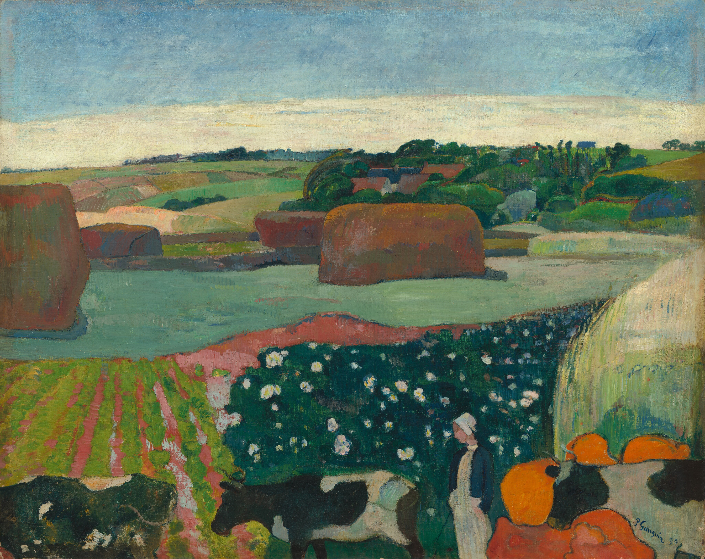

## 基本信息

- 作者: [[高更 Paul Gauguin]]
- 创作年代: 1890
- 材质: 布面油画 (*not from wiki*)
- 尺寸: 年代不详
- 现存地: (*not from wiki*) 国家美术馆 National Gallery of Art，华盛顿特区（待核）

## 画面与技法

顾衡 055 引为高更"形状简化 + 大色块装饰性"路线的典型——与《[[布列塔尼的鹅 Breton Boy in a Landscape with Goose|布列塔尼的鹅]]》成对。在画面整体已大幅平面化的同时，"某些细节还保留了印象派的小笔触"。

## 历史背景 (*not from wiki*)

1890 高更已经接受[[贝尔纳 Émile Bernard]]带来的象征主义理论；本作处于他完整转向"主观化"的边缘。

## 图片清单

| 编号 | 出自 lecture | 描述 |
|---|---|---|
| 01 | [[055｜高更1：为什么从印象派走向象征主义？]] | 全图 |

## 出现在

- [[055｜高更1：为什么从印象派走向象征主义？]]
