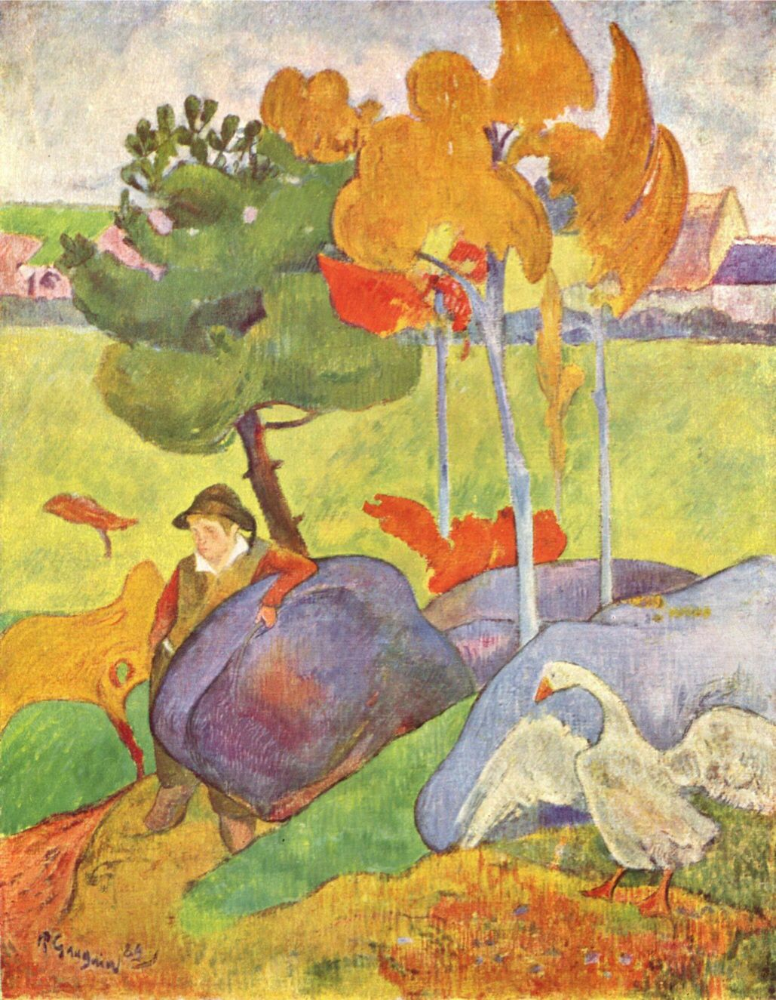

## 基本信息

- 作者: [[高更 Paul Gauguin]]
- 创作年代: 1889
- 材质: 布面油画 (*not from wiki*)
- 尺寸: 年代不详
- 现存地: (*not from wiki*)

## 画面与技法

顾衡 055 论述："虽然在某些细节还保留了印象派的小笔触，但是整体上，已经是在模仿原始人的绘画了——也就是 **形状的简化 + 大面积鲜艳的色块**，以追求一种质朴的装饰效果。"该画与《布列塔尼的干草堆》并列为这一论断的样本对。

## 历史背景 (*not from wiki*)

1889 高更于[[阿旺桥 Pont-Aven]]——"理论缺位"时期，画家们白天作画、晚上喝酒嘲笑[[修拉 Georges Seurat]]，未形成明确流派宣言。

## 图片清单

| 编号 | 出自 lecture | 描述 |
|---|---|---|
| 01 | [[055｜高更1：为什么从印象派走向象征主义？]] | 全图 |

## 出现在

- [[055｜高更1：为什么从印象派走向象征主义？]]
