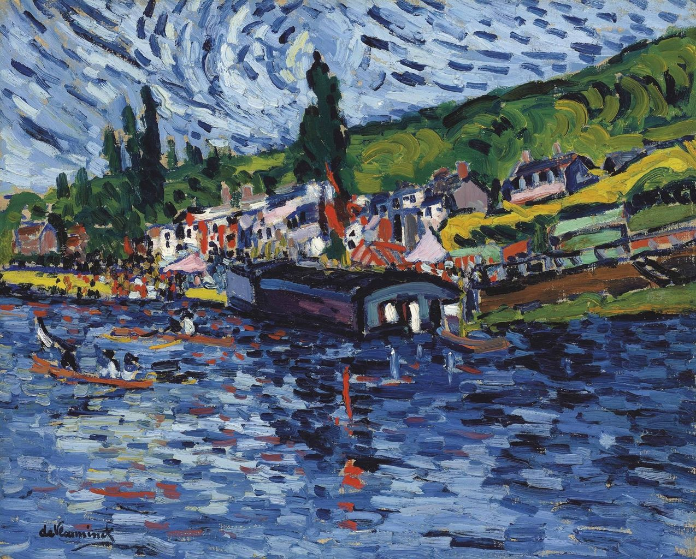
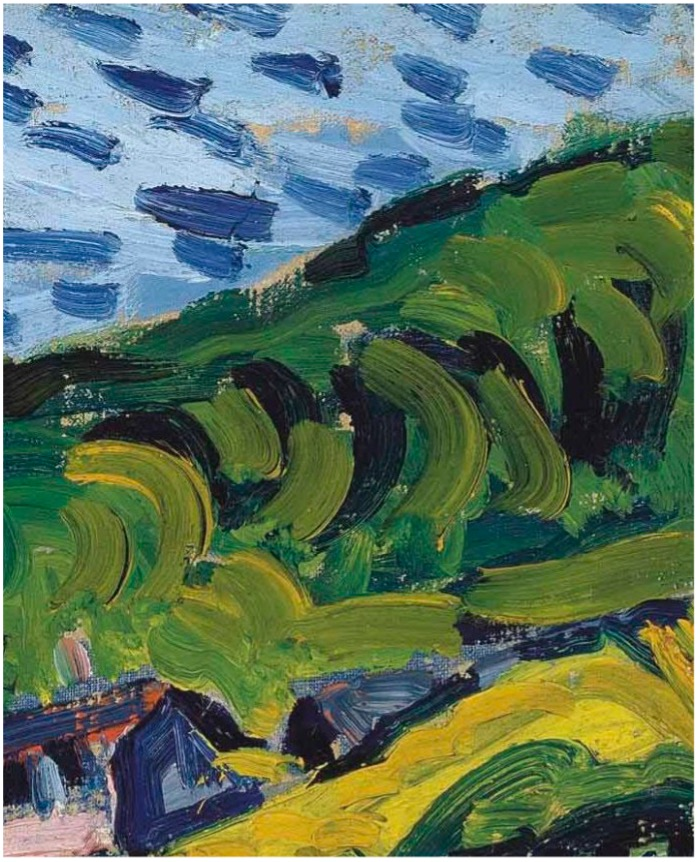

## 基本信息

- 作者：[[弗拉芒克 Maurice de Vlaminck]]
- 创作年代：1905
- 材质：油彩，画布 (*not from wiki*)
- 现存地：(*not from wiki*)

## 画面与技法

[[弗拉芒克 Maurice de Vlaminck]] 1905 年作品。布吉瓦尔 (Bougival) 是塞纳河西郊 [[印象派 Impressionism]] 画家常去的写生地点 ([[雷诺阿 Pierre-Auguste Renoir]]、[[莫奈 Claude Monet]] 都画过)；本作把同一地点处理成**狂放笔触+纯色冲撞**的野兽派语言。

顾衡 063 用本作的**局部放大**来展示弗拉芒克笔触的狂放——颜料团块**直接从颜料管挤压上去**（[[厚涂 Impasto]]）。

## 历史背景 (*not from wiki*)

- 与 [[布吉瓦尔餐厅 Restaurant de la Machine at Bougival]] 同属 1905 年布吉瓦尔系列——是 [[弗拉芒克 Maurice de Vlaminck]] 加入 [[野兽派 Fauvism]] 后的标志性作品。
- 顾衡 063 把弗拉芒克和 [[凡·高 Vincent van Gogh]] 类比：偏爱厚涂、偏爱狂放、偏爱明亮的黄色。

## 图片清单

| 编号 | 出自 | 描述 |
|---|---|---|
| 01 | [[063｜野兽派，除了马蒂斯还能谈什么？]] | 全图 |
| 02 | [[063｜野兽派，除了马蒂斯还能谈什么？]] | 局部——展示弗拉芒克狂放笔触 |

## 出现在

- [[063｜野兽派，除了马蒂斯还能谈什么？]] —— 用局部来论证弗拉芒克的狂放笔触
