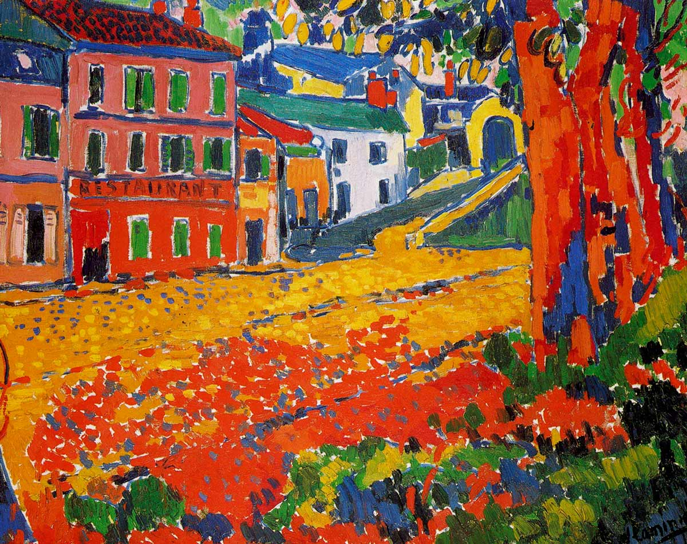

## 基本信息

- 作者：[[弗拉芒克 Maurice de Vlaminck]]
- 创作年代：1905
- 材质：油彩，画布 (*not from wiki*)
- 现存地：(*not from wiki*)

## 画面与技法

[[野兽派 Fauvism]] 1905 [[秋季沙龙展 Salon d'Automne|秋季沙龙]] 第七展室作品。**颜色非常鲜艳、运笔狂放**——红色路面、橙色屋顶、蓝紫色阴影，纯色平铺、笔触粗厚。塞纳河西郊布吉瓦尔小镇的"机器餐厅"是 19 世纪后期画家常去的写生地点（雷诺阿、莫奈也曾画过）。

## 历史背景 (*not from wiki*)

弗拉芒克 1905 年与 [[德朗 André Derain]] 在 Chatou 共用工作室；本作展于 1905 秋季沙龙第七展室，是 [[野兽派 Fauvism]] 得名场景的核心展品之一。

## 图片清单

| 编号 | 出自 | 描述 |
|---|---|---|
| 01 | [[060｜马蒂斯1：野兽派从何而来？]] | 全图——1905 秋季沙龙作品 |

## 出现在

- [[060｜马蒂斯1：野兽派从何而来？]]
