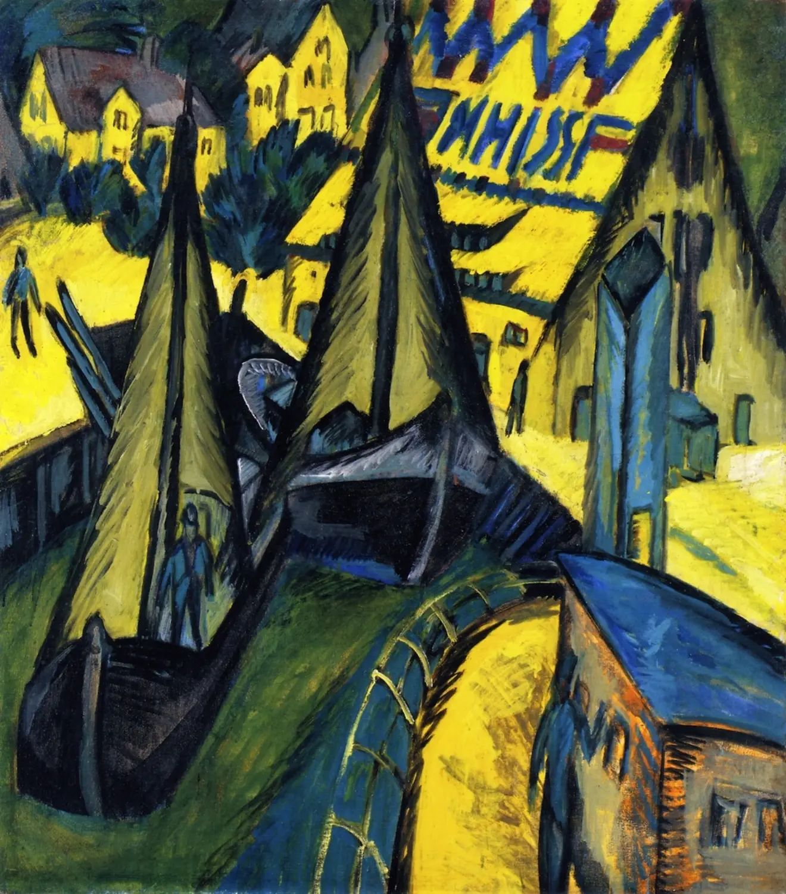

## 基本信息

- **作者**：[[基希纳 Ernst Ludwig Kirchner]]
- **创作年代**：1913
- **材质**：布面油画 (*not from wiki*)
- **尺寸**：暂不详 (*not from wiki*)
- **现存地**：暂不详 (*not from wiki*)

## 画面与技法

- 072 与 [[普利斯尼茨河口的桥 (基希纳) Bridge at the Mouth of the Priessnitz]] 同组出现，作为基希纳偏好的"哥特式高耸建筑 / 北方风景"题材代表——服务于**对德意志民族精神性和所面临困境的自觉表达**。

## 历史背景 (*not from wiki*)

布格斯他肯 (Burgstaaken) 是德国波罗的海岸费马恩岛 (Fehmarn) 上的小港——基希纳 1908 年起多次赴此地度夏作画，桥社海滨题材的重要现场。

## 图片清单

| 编号 | 出自 | 描述 |
|---|---|---|
| 01 | [[072｜桥社：什么是表现主义绘画的使命？]] | Burgstaaken Harbour 1913 |

## 出现在

- [[072｜桥社：什么是表现主义绘画的使命？]]
