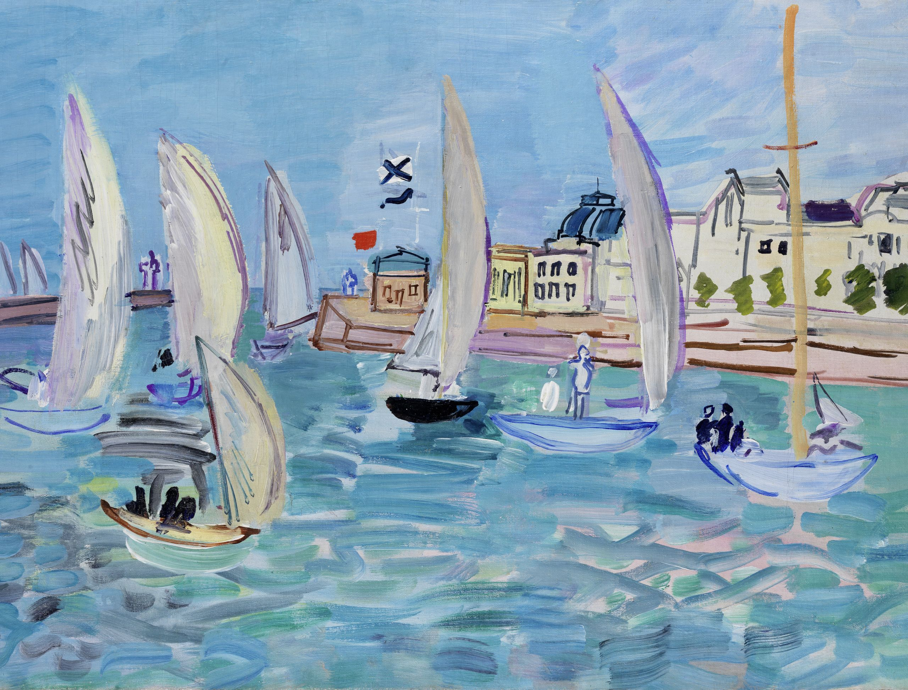

## 基本信息

- 作者：[[杜菲 Raoul Dufy]]
- 创作年代：1933
- 材质：油彩，画布 (*not from wiki*)
- 现存地：(*not from wiki*)

## 画面与技法

[[杜菲 Raoul Dufy]] 1933 年作品，海港+帆船主题——与 [[考斯的帆船比赛 Regatta at Cowes]] (1934) 同系列。

体现成熟期"**杜菲式画风**"的两层叠加：明快薄涂色域 + 原始式简率线条；色与形分离独立——既装饰又拙朴。顾衡 063 把本作与其他几幅一并放出，称是杜菲风格的稳定输出。

## 历史背景 (*not from wiki*)

- 1930 年代 [[杜菲 Raoul Dufy]] 已成为欧洲装饰画派的代表人物。
- 海港-帆船-赛马-音乐会构成杜菲后期题材四件套。

## 图片清单

| 编号 | 出自 | 描述 |
|---|---|---|
| 01 | [[063｜野兽派，除了马蒂斯还能谈什么？]] | 整幅画面 |

## 出现在

- [[063｜野兽派，除了马蒂斯还能谈什么？]] —— 顾衡"多放几幅杜菲"5 件之一
