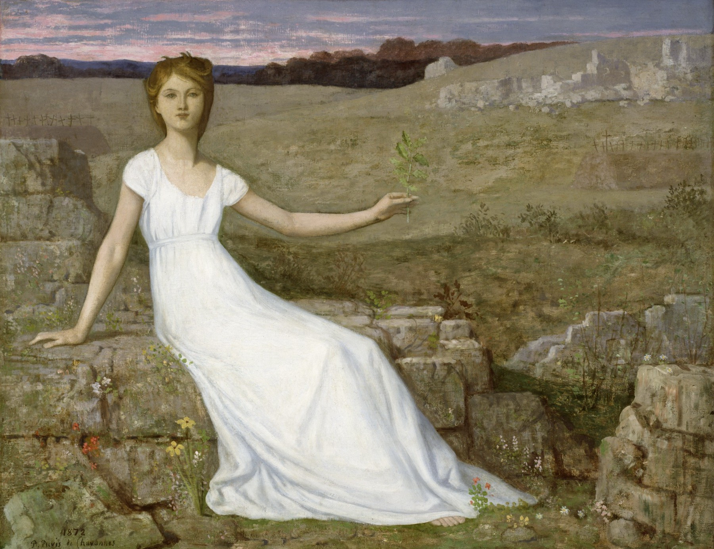
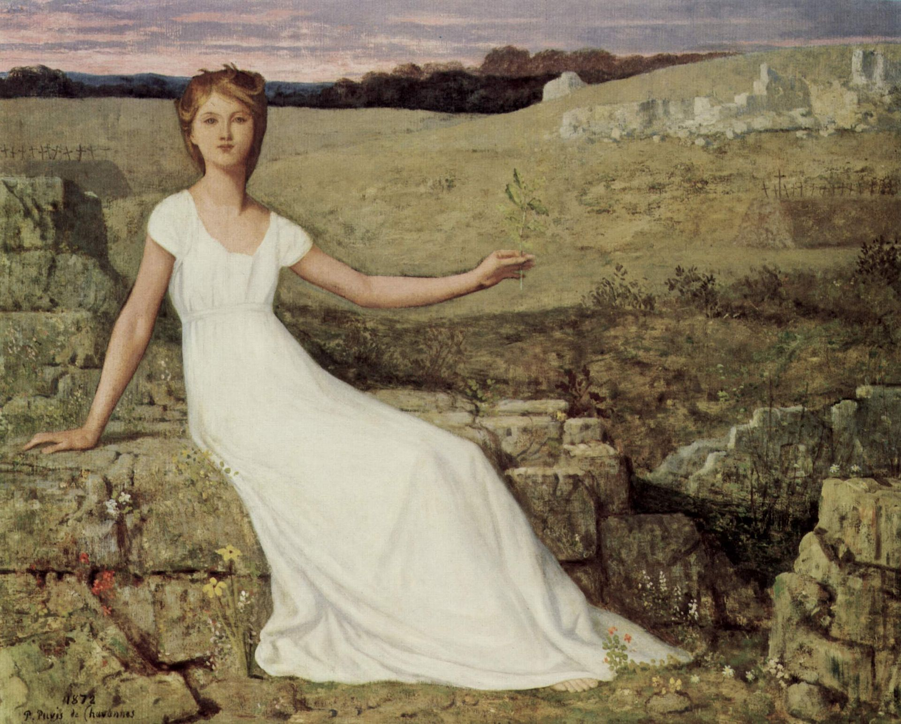

## 基本信息

- 作者：[[夏凡纳 Pierre Puvis de Chavannes]]
- 创作年代：1872
- 材质：油彩、画布 (*not from wiki*)
- 尺寸：约 70 × 82 cm (*not from wiki*)
- 现存地：法国巴黎 · 奥赛博物馆 (Musée d'Orsay, Paris) —— 另有同题材异版藏于美国巴尔的摩 · 沃尔特斯艺术博物馆 (*not from wiki*)

## 画面与技法

**[[夏凡纳 Pierre Puvis de Chavannes]] 最著名的作品**。普法战争 (1870–1871) 战败之后法国政府一蹶不振、人民士气低落——画面中：

- **少女坐在一片废墟上** —— 暗示战后法国社会的状况；
- **白色连衣裙**、手持 **橄榄枝**（《圣经》洪水退去后诺亚鸽子衔回橄榄枝的象征 → "否极泰来"、新希望）；
- **僵硬的姿态、洋娃娃般的五官** —— 正是 **舞台剧标准动作的思路**：即使把人物拿出画面，大家也能猜出意义；
- **天空压得很低、朝霞满天** —— 渲染即将升起的太阳的"无法遏制的力量"；
- 前景 **几朵红、黄、白小野花** —— 在贫瘠土地上顽强地绽放。

这种 **简化** 本来只是夏凡纳对意大利文艺复兴前湿壁画的借鉴，但被 [[象征主义 Symbolism]] 加冕"最伟大艺术大师"之后，夏凡纳自己也心领神会，全盘接受了象征主义"**相对于每一种明确的思想，都存在着与其相匹配的造型手段**"的纲领。

## 历史背景 (*not from wiki*)

1870–1871 普法战争法国战败、巴黎被围、第二帝国覆灭、巴黎公社失败——是 19 世纪法国国族创伤之最。本画以 **少女 + 橄榄枝 + 废墟 + 朝霞** 的视觉密码包装这一时代情绪，成为夏凡纳的最广为流传的形象。

## 图片清单

| 编号 | 出自 | 描述 |
|---|---|---|
| 01 | [[049｜夏凡纳：如何制作象征主义的密电码？]] | 整幅画面 |

## 出现在

- [[049｜夏凡纳：如何制作象征主义的密电码？]] —— 用于说明 **舞台剧标准动作 + 密电码式造型语言**
