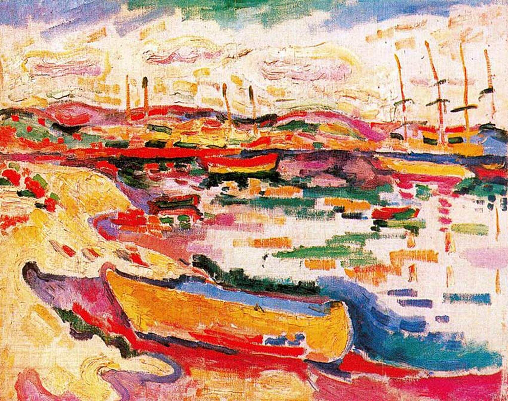

## 基本信息

- 作者：[[勃拉克 Georges Braque]]
- 创作年代：1907
- 材质：布面油画 (*not from wiki*)
- 尺寸：年代不详 (*not from wiki*)
- 现存地：年代不详 (*not from wiki*)

## 画面与技法

[[勃拉克 Georges Braque]] [[野兽派 Fauvism]] 末期 / 转向 [[立体主义 Cubism]] 前夜的代表作——

- 顾衡（066）用本作和《[[安特卫普近郊的风景 Landscape near Antwerp]]》举证：勃拉克尽管挂着野兽派的旗号，**作品里已经表现出更多 [[塞尚 Paul Cézanne]] 的元素**——尤其是几何化的体块、克制的色彩结构。
- 这种 **"塞尚成分高于色彩成分"** 的画家底色，使勃拉克在 1907 年看到 [[毕加索 Pablo Picasso]] 的《[[亚威农少女 Les Demoiselles d'Avignon|亚威农少女]]》之后迅速转向——成为 [[分析立体主义 Analytical Cubism]] 阶段的理念主导者。
- 地名 La Ciotat（拉锡奥塔，法国南部地中海港口）是 1907 年夏天勃拉克与友人 Othon Friesz 一起写生的地点。

## 历史背景 (*not from wiki*)

- 1907 年夏天勃拉克在 La Ciotat 与 [[弗里兹 Othon Friesz]] 一起作画——两人都是野兽派 Le Havre 小组成员，但已开始向塞尚靠拢。
- 同年秋天勃拉克回到巴黎，在毕加索工作室见到《[[亚威农少女 Les Demoiselles d'Avignon|亚威农少女]]》，先骂"像吃木屑石蜡"，旋即倒戈与毕加索共创立体主义。

## 图片清单

| 编号 | 出自 | 描述 |
|---|---|---|
| 01 | [[066｜毕加索3：什么是分析立体主义？]] | 全图——勃拉克野兽派末期作品；塞尚成分明显 |

## 出现在

- [[066｜毕加索3：什么是分析立体主义？]] —— 勃拉克"塞尚底色"的举证，转向 [[立体主义 Cubism]] 的前奏
