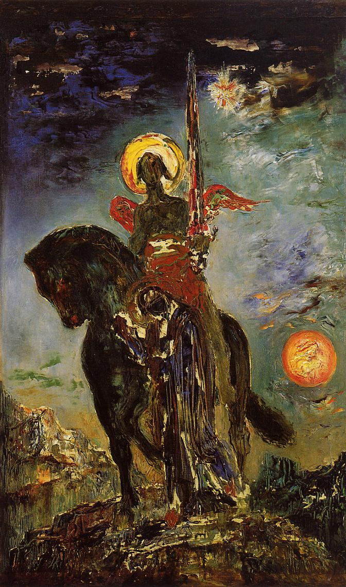

## 基本信息

- 作者：[[莫罗 Gustave Moreau]]
- 创作年代：1890
- 材质：油彩 / 画布 (*not from wiki*)
- 尺寸：年代不详
- 现存地：(*not from wiki*) 莫罗博物馆 Musée Gustave Moreau, Paris

## 画面与技法

莫罗晚期代表作——画中的帕卡（**Parca**）即希腊神话中**命运三女神之一的阿特罗波斯（Atropos）**——掌管"剪断命运之线"的死亡女神。本作 **"画中人物已成色彩狂欢的一个由头和载体"**（顾衡 050 评）——叙事和图像志已**完全让位于色彩本身的运动与情绪**：颜料堆叠近乎抽象、人物轮廓化作色块、神话主题退缩为色彩狂欢的借口。

这是莫罗 [[象征主义 Symbolism]] **朦胧路径**的逻辑终点——**色彩的狂放 + 对具体含义的拒斥** —— 直接通向其学生 [[马蒂斯 Henri Matisse]] 与后来的 [[野兽派 Fauvism]]（"野兽派的时候，仍然可以看到莫罗的影子" —— 顾衡 050）。

## 历史背景

(*not from wiki*) 1890 年——莫罗去世前 8 年；本作可视为他**晚期色彩实验**的标志，与他在巴黎国立美术学院执教（自 1891 起）培养出包括马蒂斯、鲁奥（Georges Rouault）、马尔凯（Albert Marquet）等下一代色彩派画家的师承传承一脉相承。

## 图片清单

| 编号 | 出自 | 描述 |
|---|---|---|
| 01 | [[050｜莫罗：象征主义绘画为什么走向朦胧？]] | 1890 全图——莫罗晚期色彩狂欢代表 |

## 出现在

- [[050｜莫罗：象征主义绘画为什么走向朦胧？]]
