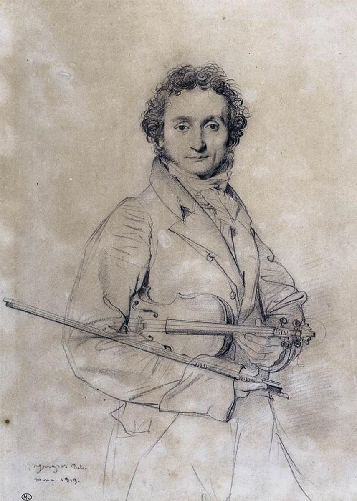

## 基本信息

- 作者：[[安格尔 Jean-Auguste-Dominique Ingres]]
- 创作年代：1819
- 材质：纸本石墨素描 (*not from wiki*)
- 尺寸：(*not from wiki*) 小型肖像素描
- 现存地：(*not from wiki*) 卢浮宫等收藏机构

## 画面与技法

正立全身肖像素描——帕格尼尼立姿，手持小提琴琴弓。安格尔用**精准的轮廓线条**勾勒人物——是其"线条派"功夫的代表性素描案例 (*not from wiki*)。

## 历史背景

(*not from wiki*) 安格尔 1819 年于意大利期间为终生好友、意大利小提琴家 [[帕格尼尼 Niccolò Paganini]] 绘制——两人都是音乐与绘画双修的艺术家：安格尔本人 12 岁起就是图卢兹剧团乐队第二小提琴手，与帕格尼尼以乐会友。本素描见证 19 世纪初艺术家跨媒介社交圈的紧密。

## 图片清单

| 编号 | 出自 | 描述 |
|---|---|---|
| 01 | [[032｜安格尔：为什么他是学院派最后一位大师？]] | 整体素描图 |

## 出现在

- [[032｜安格尔：为什么他是学院派最后一位大师？]]
