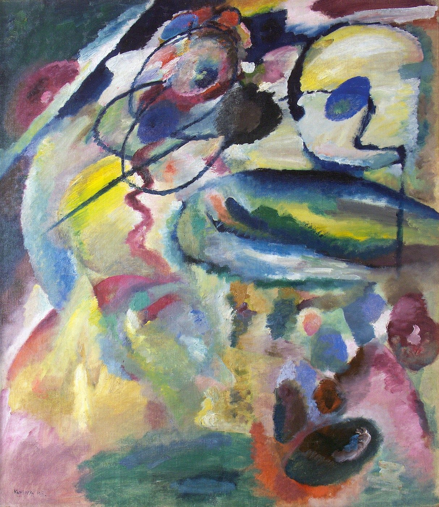

## 基本信息

- 作者：[[康定斯基 Wassily Kandinsky]]
- 创作年代：1911
- 材质：布面油画 (*not from wiki*)
- 尺寸：约 139 × 111 cm (*not from wiki*)
- 现存地：第比利斯国家艺术博物馆，格鲁吉亚 (*not from wiki*)

## 画面与技法

康定斯基自述并被英国艺术史学者 **威尔·贡培兹** (Will Gompertz) 等认定为**历史上第一幅完全抽象的作品**。线条与色块漂浮交织，无可辨认的客观物象。

顾衡 082 论点：**以 1912 年为分界**，康定斯基进入抽象绘画阶段；本作（1911）是公认的"门槛"作品。但顾衡也指出 —— 康定斯基随后**多次反复**（参见同时期《[[即兴26 Improvisation 26 (Rowing)]]》《[[有白边的画 Painting with White Border]]》等仍带具象事后解释），所以即便此画是"第一幅完全抽象"，他走向抽象**并非神启式的突变，而是渐进过程**。

## 历史背景 (*not from wiki*)

康定斯基 1909 起住在巴伐利亚小镇 Murnau，与女友 Gabriele Münter 同住的"俄罗斯人之家"是青骑士团体酝酿地。1911 年完成本作，同年与马尔克等组建 [[青骑士 Der Blaue Reiter]]。本画后被康定斯基带回俄罗斯，最终留存格鲁吉亚。

## 图片清单

| 编号 | 出自 | 描述 |
|---|---|---|
| 01 | [[082｜康定斯基2：他为什么走向抽象？]] | 公认的"第一幅完全抽象的画" |

## 出现在

- [[082｜康定斯基2：他为什么走向抽象？]]
