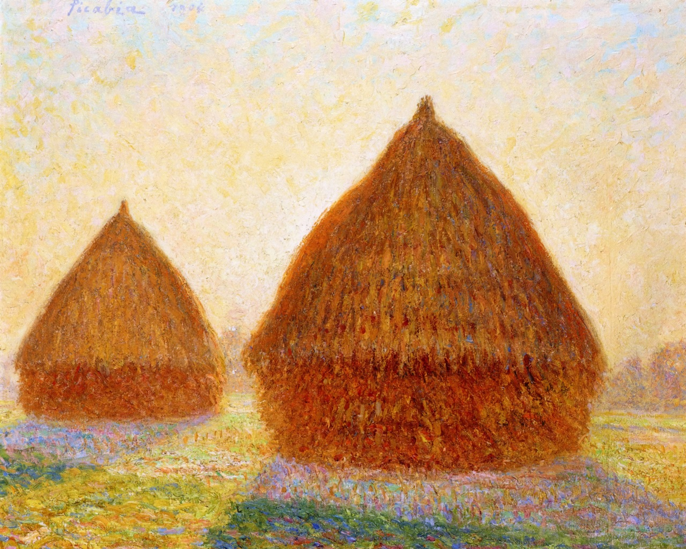

## 基本信息

- 作者：[[毕卡比亚 Francis Picabia]]
- 创作年代：1904
- 材质：布面油画 (*not from wiki*)
- 尺寸：年代不详 (*not from wiki*)
- 现存地：私人收藏 (*not from wiki*)

## 画面与技法

[[毕卡比亚 Francis Picabia]] 印象派出道期作品——"晚上轮廓"的母题直接呼应 [[莫奈 Claude Monet]] 著名的《干草垛》[[组画 Series Paintings]]。

## 历史背景

(*not from wiki*) 毕卡比亚刻意致敬莫奈、毕沙罗的印象派 [[组画 Series Paintings]] 传统。

## 图片清单

| 编号 | 出自 | 描述 |
|---|---|---|
| 01 | [[091｜毕卡比亚：如何用绘画表现达达主义？]] | 整体图 — 黄昏中的干草垛 |

## 出现在

- [[091｜毕卡比亚：如何用绘画表现达达主义？]]
