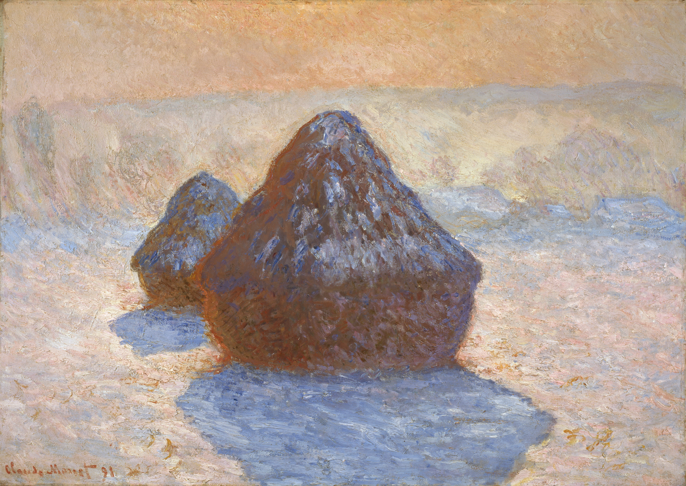
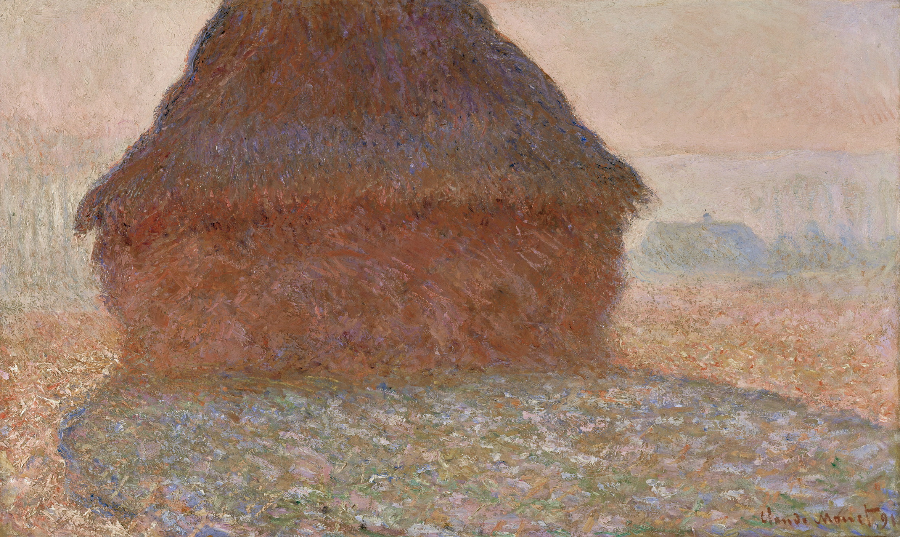
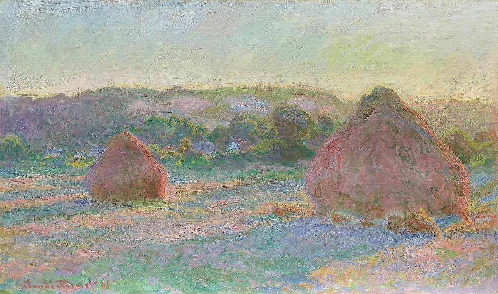

## 基本信息

- 作者：[[莫奈 Claude Monet]]
- 创作年代：1890–1891 （共约 25 幅）(*not from wiki*)
- 材质：布面油画 (*not from wiki*)
- 尺寸：约 60 × 100 cm（不一）(*not from wiki*)
- 现存地：分散于芝加哥艺术博物馆、奥赛美术馆、波士顿美术馆、苏黎世美术馆等 (*not from wiki*)

## 画面与技法

吉维尔尼附近田野中的小麦堆——莫奈在不同**时刻、季节、天气、光线**下反复画的同一题材。

042 顾衡的关键论述：这是 [[组画 Series Paintings]] 的标志开端——

> "**一天之内不同时间的光线是千变万化的。如果一幅一幅地画，光线条件一变，就没法工作了。所以莫奈就一字排开十几个画架，7 点到 8 点画一号画架，8 点到 9 点画二号画架。这就是莫奈的《干草垛》《鲁昂大教堂》和《睡莲》的由来。**"

**操作模式**：

- 多画架同时摆开 → 同一时刻光线对应同一画架
- 实现了"光线 + 时间"纪律在生产层面的工业化

## 历史背景 (*not from wiki*)

[[爱丽丝·奥什逮 Alice Hoschedé]] 提议莫奈做组画。1891 年 [[丢朗-吕厄 Paul Durand-Ruel]] 在巴黎办专题展，15 幅干草垛三天售罄，奠定莫奈晚年财富与国际声誉。**康定斯基自述被一幅干草垛触动而走向抽象。**

## 图片清单

| 编号 | 出自 | 描述 |
|---|---|---|
| 01 | [[042｜莫奈2：《日出·印象》是不是印象派作品？]] | 系列选作 1 |
| 02 | [[042｜莫奈2：《日出·印象》是不是印象派作品？]] | 系列选作 2 |
| 03 | [[042｜莫奈2：《日出·印象》是不是印象派作品？]] | 系列选作 3 |

## 出现在

- [[042｜莫奈2：《日出·印象》是不是印象派作品？]]
