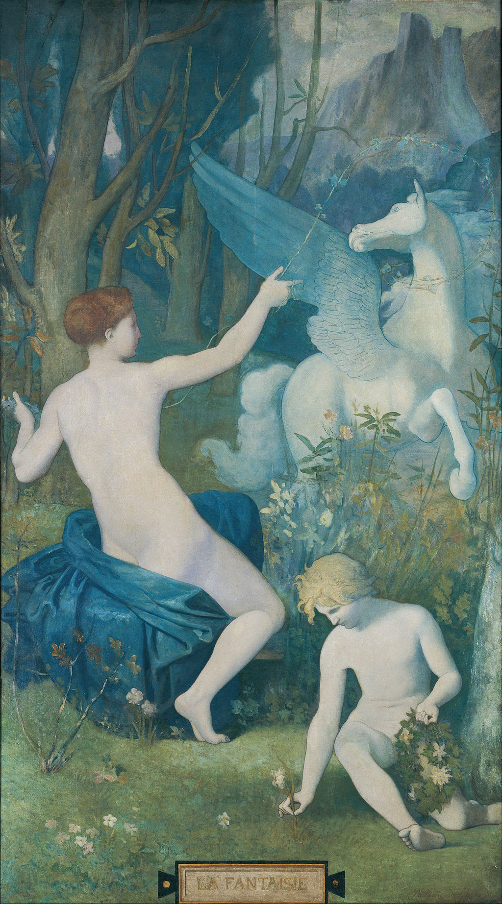

## 基本信息

- 作者：[[夏凡纳 Pierre Puvis de Chavannes]]
- 创作年代：1866
- 材质：油彩 / 画布 (*not from wiki*)
- 尺寸：(*not from wiki*) 未核实
- 现存地：(*not from wiki*) 未核实

## 画面与技法

(*not from wiki*) 一名年轻女子骑着白马（带有飞马 Pegasus 寓意）在海滨景观中行进——夏凡纳标志性的**淡彩、平涂、近壁画质感**的画面语言。本课 048 出场的画面在 caption 中被简要标注为"夏凡纳 幻想 1866"——顾衡用它**与上图莫罗《俄狄浦斯》及下文修拉《大碗岛》并置**，把读者从"科学画画"过渡到"主观的客观化"——象征主义画面**主题模糊、不强调叙事**，与之后 049 lecture 详细展开的夏凡纳壁画风格连为一线。

## 历史背景

(*not from wiki*) 夏凡纳 1860s–1890s 代表法国象征主义壁画路线——画面静穆、装饰性、轻情节，下启 1890s 那比派 / 高更（049 详）。

## 图片清单

| 编号 | 出自 | 描述 |
|---|---|---|
| 01 | [[048｜什么是象征主义？]] | 1866 全图，本课在象征主义"主观客观化"理论展示段落出场 |

## 出现在

- [[048｜什么是象征主义？]]
