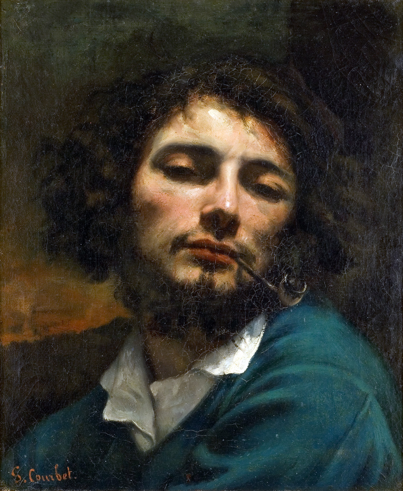

## 基本信息

- 作者：[[居斯塔夫·库尔贝 Gustave Courbet]]
- 创作年代：1848–1849（顾衡 035 caption；实际原作 1842–1844，1846 修订）(*not from wiki*)
- 材质：布面油画 (*not from wiki*)
- 尺寸：约 46 × 56 cm (*not from wiki*)
- 现存地：巴黎小皇宫博物馆 Petit Palais, Paris (*not from wiki*)

## 画面与技法

库尔贝半身坐姿，旁伴一条黑色西班牙猎犬。顾衡 035 用此画做证："**库尔贝这个人非常自恋，喜欢博眼球，这是艺术史上公认的**。"

## 历史背景

(*not from wiki*) 此画是库尔贝第一幅入选沙龙的作品（1844）。顾衡 035 caption 标 "1848–1849" 可能是涉及一处修订 / 修复版本，原作年代仍以 1842 计。

## 图片清单

| 编号 | 出自 | 描述 |
|---|---|---|
| 01 | [[035｜库尔贝：为什么现实主义的开创者争议那么大？]] | 半身自画像，伴黑狗 |

## 出现在

- [[035｜库尔贝：为什么现实主义的开创者争议那么大？]]
