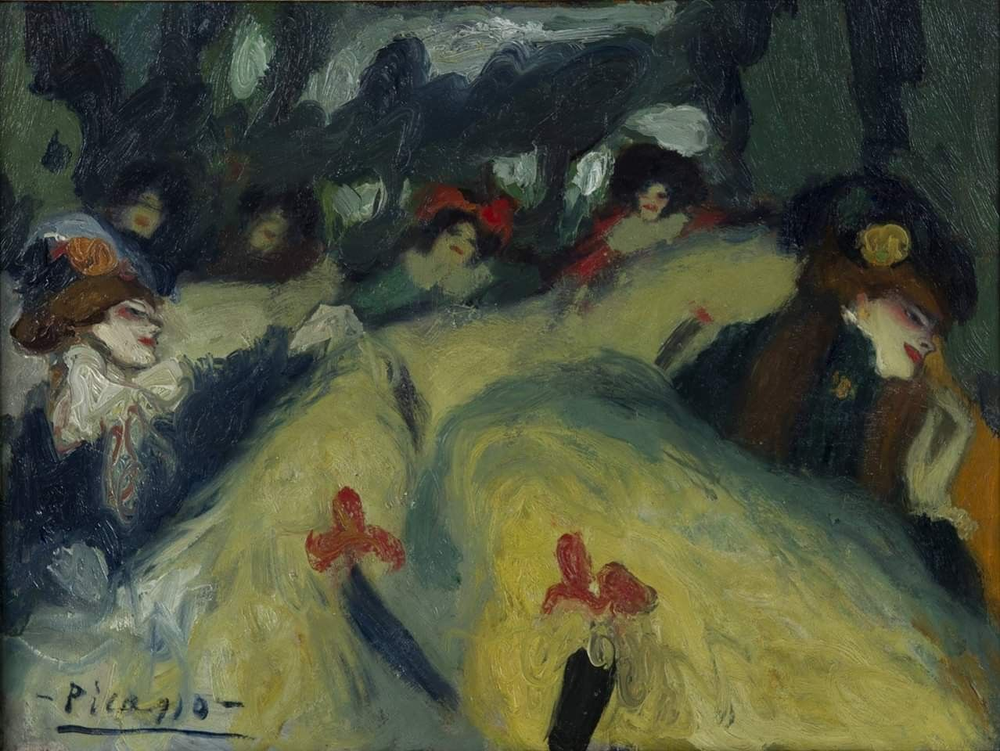

## 基本信息

- 作者：[[毕加索 Pablo Picasso]]
- 创作年代：1901
- 材质：布面油画 (*not from wiki*)
- 尺寸：年代不详 (*not from wiki*)
- 现存地：私人收藏 (*not from wiki*)

## 画面与技法

[[蓝色时期 Blue Period]] 早期"可高兴可欢乐"的作品——蒙马特红磨坊式的康康舞场面、女舞者高踢腿动作。本讲（064）以此与 [[粗野的拥抱 The Brutal Embrace]] 一同 **反驳"蓝色 = 抑郁悲伤"的望文生义**：1901 年的毕加索沉湎肉欲、画了不少色情画，根本没有"抑郁"的实质内容。

> 注：与 [[马奈 Édouard Manet]] 的 *The Can-can* / [[修拉 Georges Seurat]] 的 *Le Chahut* / [[劳特累克 Henri de Toulouse-Lautrec]] 同题材作品都不同——本作为毕加索 1901 年版本。 (*not from wiki*)

## 历史背景 (*not from wiki*)

- 创作于 1901 年——毕加索此时与同乡 Carlos Casagemas 之死的悲恸（Casagemas 2 月自杀）正在转化为蓝色时期的形成动力；但题材层面仍以蒙马特夜场为主。

## 图片清单

| 编号 | 出自 | 描述 |
|---|---|---|
| 01 | [[064｜毕加索1：如何理解"蓝色时期"和"玫瑰红时期"？]] | 整幅画面 |

## 出现在

- [[064｜毕加索1：如何理解"蓝色时期"和"玫瑰红时期"？]]
