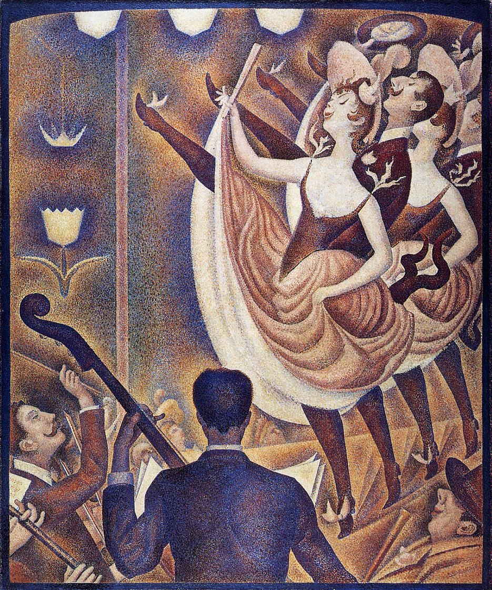

## 基本信息

- **作者**：[[修拉 Georges Seurat]]
- **创作年代**：1889–1890
- **材质**：(*not from wiki*) 布面油画
- **尺寸**：(*not from wiki*) 169 × 139 cm
- **现存地**：(*not from wiki*) 奥特罗 Kröller-Müller 博物馆 (Kröller-Müller Museum, Otterlo)

## 画面与技法

修拉**用 [[昂里 Charles Henry]] 的"线条情绪科学"做的第一个实验**（顾衡 047）。修拉问自己："**既然我发现了颜色的科学规律，那我能不能发现线条的规律呢？**"——昂里的理论恰逢其时：

> "同样一个线条，从下往上的，和从左往后的，让人看着就开心。而从上往下和从右向左的线条，人一看就不开心。"

修拉听后非常兴奋，把这套理论搬进《康康舞》——

> "**舞女的腿和提琴，甚至女演员的嘴角和男演员的胡子，都是严格平行的，整齐划一。**"

技法上仍是 [[点彩 Pointillism]] / [[分色主义 Divisionism]]，且开始使用**更小的点子**——顾衡："**如果小点子更细，绘画不就更科学了吗？就像咱们今天的手机，像素越高，图片不就越清晰吗？修拉也是这么想的。**" → 直接引出《[[马戏 The Circus]]》中**[[更细笔触致画面变暗 Smaller Dot Darkening]]** 的反噬。

## 历史背景 *(not from wiki)*

- 1889 年法国大革命百年；同年巴黎万国博览会、埃菲尔铁塔落成；夜生活产业（康康舞 / 红磨坊等）蓬勃发展
- 1890 年首展于 *Salon des Indépendants*；同年罗特列克也大量画康康舞——但与修拉的科学化笔触形成鲜明对比
- 1922 年由 Kröller-Müller 夫妇买入；至今为该馆藏品

## 在新印象主义谱系中的位置

| 修拉创作阶段 | 代表作 | 特点 |
|---|---|---|
| 色彩科学化 | 《[[大碗岛的星期天下午 A Sunday Afternoon on the Island of La Grande Jatte]]》(1884–1886) | 22 色色轮 + 标准小圆点 |
| **+ 线条情绪科学化** | **《康康舞》(1889–1890)** | **更小点子 + 严格平行线条** |
| 反噬让步 | 《[[马戏 The Circus]]》(1890–1891) | 马 / 小丑改回平涂 |

## 图片清单

| 编号 | 出自 | 描述 |
|---|---|---|
| 01 | [[047｜修拉：新印象主义为什么走进了死胡同？]] | 整幅画作 |

## 出现在

- [[047｜修拉：新印象主义为什么走进了死胡同？]] —— 修拉吸纳昂里线条理论的实验样本
