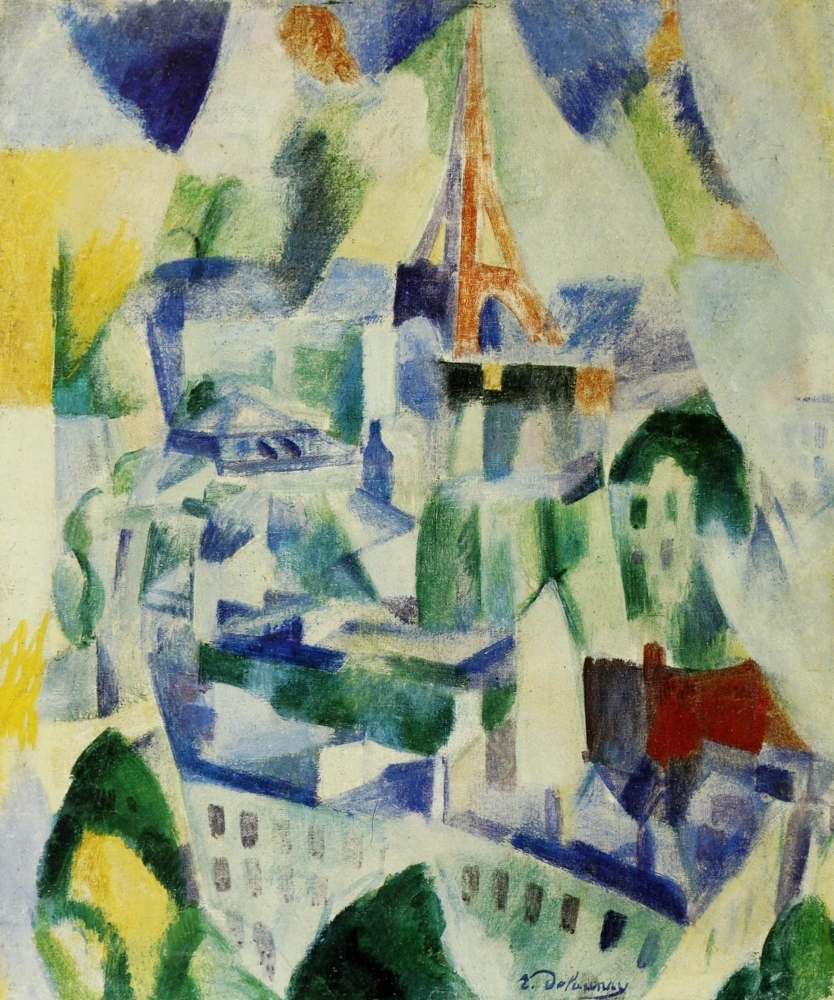

## 基本信息

- 作者：[[德劳内 Robert Delaunay]]
- 创作年代：1910—1914
- 材质：布面油画 (*not from wiki*)
- 尺寸：约 110 × 130 cm (*not from wiki*)
- 现存地：泰特现代美术馆 (Tate Modern, 伦敦) / 数版本 (*not from wiki*)

## 画面与技法

德劳内"**窗"系列**——从工作室窗框俯瞰巴黎街景。画面里**埃菲尔铁塔的剪影隐约可辨**，但周围的建筑都被分解为**菱形、三角形、四边形的彩色棋盘**；具象几乎完全溶解为色彩与几何的振动。

顾衡视角：与圣塞沃林、圣母院的尖塔、埃菲尔铁塔系列**同一逻辑**——"**越画越模糊、越画越抽象**"。其原因是，对德劳内来说**艺术语言并不是形状，而是色彩本身**。

## 历史背景 (*not from wiki*)

"窗"系列共 22 幅，是 [[阿波利奈尔 Guillaume Apollinaire]] 提出"**俄耳浦斯立体主义 (Orphism)**"概念时直接引用的作品。1912 年阿波利奈尔为这组画写了同名诗《Les Fenêtres》。

## 图片清单

| 编号 | 出自 | 描述 |
|---|---|---|
| 01 | [[068｜立体主义，除了毕加索还值得了解什么？]] | "窗"系列代表作；铁塔与街区融为色彩棋盘 |

## 出现在

- [[068｜立体主义，除了毕加索还值得了解什么？]] —— 俄耳浦斯立体主义概念的代表作
