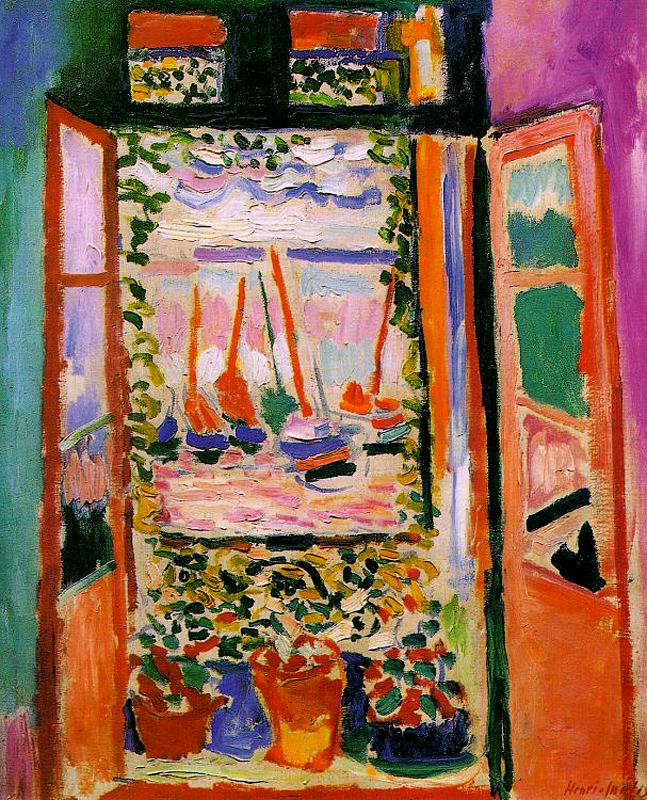

## 基本信息

- 作者：[[马蒂斯 Henri Matisse]]
- 创作年代：1905
- 材质：布面油画 (*not from wiki*)
- 尺寸：约 55.3 × 46 cm (*not from wiki*)
- 现存地：美国华盛顿国家美术馆 (National Gallery of Art, Washington D.C.) (*not from wiki*)

## 画面与技法

1905 年夏 [[马蒂斯 Henri Matisse]] 在法国南部 Collioure 创作的窗景：透过敞开的法式百叶窗，远处的港湾、几艘小船、桅杆和远方天空尽收画中。

色彩选择完全脱离自然观察：

- **天空被画成粉紫色**；
- **大海被画成粉红色**；
- **桅杆与帆船是大块的红、绿、青色块**；
- **窗框与墙面也以互补色相对峙**。

马蒂斯对此的辩护是"**凭感觉**"——"我觉得粉红色的大海看着对劲儿，你管不着"。这是 [[野兽派 Fauvism]] **主观色彩自由** 最直白的样本：与 [[象征主义 Symbolism]] 的"主观的客观化"（每种颜色都对应固定的密码意义）正好相反——野兽派的颜色只指向画家自己当下的感觉。

## 历史背景 (*not from wiki*)

- 与 [[戴帽子的女人 Woman with a Hat]] 同在 1905 年秋季沙龙展出，是野兽派首次集体亮相的核心作品之一。
- 现藏华盛顿国家美术馆 (惠特尼夫人捐赠)。

## 图片清单

| 编号 | 出自 | 描述 |
|---|---|---|
| 01 | [[061｜马蒂斯2：为什么说野兽派不"野兽"？]] | 整幅画面 |

## 出现在

- [[061｜马蒂斯2：为什么说野兽派不"野兽"？]] —— 作为"凭感觉用色"的典型样本
