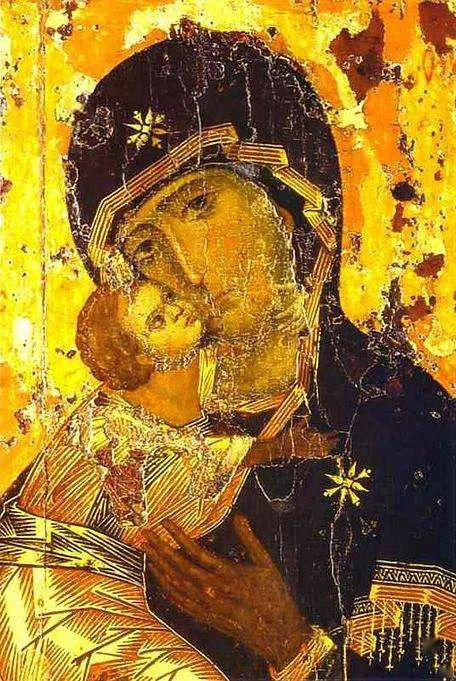
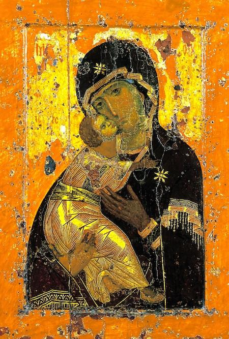

## 基本信息

- 作者：匿名拜占庭画家（君士坦丁堡画派）(*not from wiki*)
- 创作年代：约 1131（拜占庭原作）；后期多次修复 (*not from wiki*)
- 材质：木板蛋彩、金底 (*not from wiki*)
- 尺寸：104 × 69 cm (*not from wiki*)
- 现存地：莫斯科特列季亚科夫画廊 (Tretyakov Gallery)，原藏弗拉基米尔大教堂；俄罗斯东正教**国家级圣像** (*not from wiki*)

## 画面与技法

正面四分之三视角构图。圣母玛利亚怀抱小耶稣，圣子的脸贴向圣母的脸颊——这是 **Eleusa 型 (Theotokos of Tenderness)** 的典型：圣母与圣子之间**有亲昵触碰**，区别于更冷峻的 *Hodegetria* 型。(*not from wiki*)

- 圣母眼神忧伤、悲悯，知晓圣子未来的命运；
- 圣子伸手搂着圣母的颈部；
- 圣母与圣子都沐浴在金色光中——**金光既是天堂之光，也是圣母与圣子神性的象征**；
- 衣袍是深红 (圣母) 与金黄 (圣子) 的对比；
- 圣母头顶的两颗星 (额头与两肩) 是 Aeiparthenos (永贞) 的标志，标识她"领报前-领报中-领报后"皆为童贞。

顾衡称它**"几乎就是拜占庭艺术中圣母与基督的标准像"**——后世西方各种 Madonna 图像都是从这种 Eleusa 程式逐步偏离的。

## 历史背景

(*not from wiki*) 1131 年由君士坦丁堡的工坊画成，作为外交礼物送往基辅罗斯；其后几经转移，1155 年迁往弗拉基米尔，1395 年迁莫斯科，1918 年起进入特列季亚科夫画廊。被信徒视为创造了多次保护俄国免遭外敌（如 1395 年帖木儿撤兵）的奇迹画。

顾衡在 [[004｜拜占庭艺术：程式化的艺术是怎么回事？]] 用它作为拜占庭艺术**金光与圣像合一**的范型——支持其论点 "拜占庭人对光的追求 = 早期基督徒对《圣经》原教旨解读立场（'要有光'、'看见了大光'）"。

## 图片清单

| 编号 | 出自 | 描述 |
|---|---|---|
| 01 | [[004｜拜占庭艺术：程式化的艺术是怎么回事？]] | 整体图 |
| 02 | [[005｜哥特艺术1：为什么说它是文艺复兴的前奏？]] | 同一作品的不同 CDN 版本 / 裁剪 |

## 出现在

- [[004｜拜占庭艺术：程式化的艺术是怎么回事？]]
- [[005｜哥特艺术1：为什么说它是文艺复兴的前奏？]]（作为拜占庭"岁月静好画圣母子"的代表，与欧洲苦出身教会的悲苦题材形成对照）
