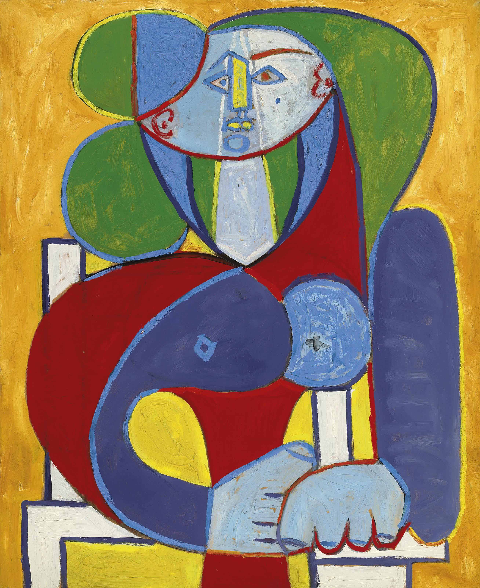

## 基本信息

- 作者：[[毕加索 Pablo Picasso]]
- 创作年代：1946
- 材质：(*not from wiki*) 石版画 / 油画（同名作有多个版本）
- 尺寸：年代不详
- 现存地：年代不详

## 画面与技法

模特为毕加索情人 [[弗朗索瓦斯·吉洛 Françoise Gilot]]。画面以**线条简化的几何脸庞**呈现弗朗索瓦斯——面部正侧合一、植物状卷发、椭圆杏眼——是 [[综合立体主义 Synthetic Cubism]] 晚期"花女" (Femme-fleur) 风格的延续。

顾衡 067 列入"为情人画肖像、风格高度雷同"的样本之一。

## 历史背景

(*not from wiki*) 弗朗索瓦斯·吉洛 (Françoise Gilot, 1921-2023) 是毕加索 1943 年（她 21 岁、毕加索 61 岁）起的情人、画家、作家，与毕加索育有二子（Claude 1947、Paloma 1949）。她是**少数主动离开毕加索的女性**（1953）——后嫁给小儿麻痹疫苗发明人乔纳斯·索尔克 (Jonas Salk)；1964 年出版《与毕加索的生活》(Life with Picasso) 详细揭露毕加索的私生活，引发毕加索勃然大怒。

## 图片清单

| 编号 | 出自 | 描述 |
|---|---|---|
| 01 | [[067｜毕加索4：什么是综合立体主义？]] | 整体图 |

## 出现在

- [[067｜毕加索4：什么是综合立体主义？]]
