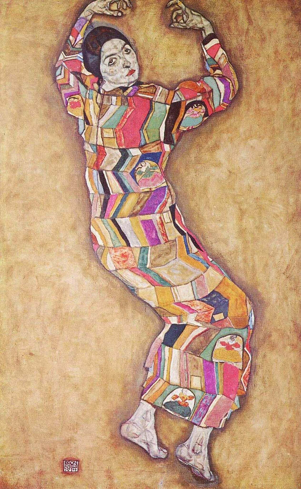

## 基本信息

- **作者**：[[席勒 Egon Schiele]]
- **创作年代**：1914
- **材质**：油彩，画布 (*not from wiki*)
- **现存地**：私人收藏 (*not from wiki*)

## 画面与技法

席勒为维也纳收藏家之女 Friederike Maria Beer 所作肖像。延续了 [[克里姆特 Gustav Klimt]] 装饰风格的影响——**几何形状的色块**与**纯粹的装饰效果**（顾衡 075）。

## 历史背景 (*not from wiki*)

Friederike Maria Beer 是维也纳上流社会的赞助人，同年也曾为 [[克里姆特 Gustav Klimt]] 做模特——这反映了 [[维也纳分离派 Vienna Secession]] / [[维也纳工坊 Wiener Werkstätte]] 圈子内**赞助人与画家网络**的紧密度。

## 图片清单

| 编号 | 出自 | 描述 |
|---|---|---|
| 01 | [[075｜席勒2：为什么他是"最表现主义"的画家？]] | 肖像全身 |

## 出现在

- [[075｜席勒2：为什么他是"最表现主义"的画家？]]
