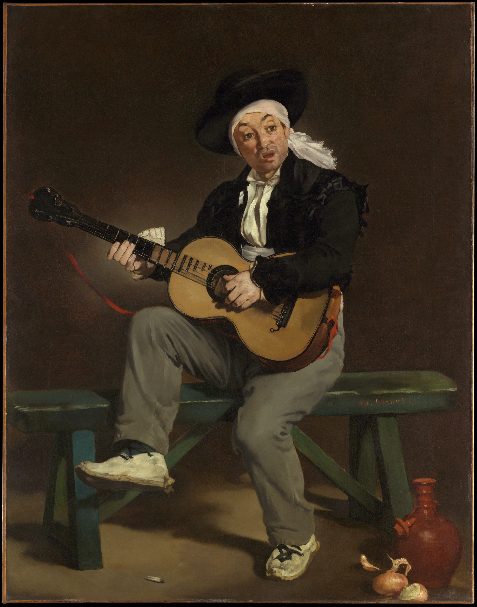

## 基本信息

- 作者：[[马奈 Édouard Manet]]
- 创作年代：1860
- 材质：油彩，画布 (*not from wiki*)
- 尺寸：147.3 × 114.3 cm (*not from wiki*)
- 现存地：纽约大都会艺术博物馆 (*not from wiki*)

## 画面与技法

[[马奈 Édouard Manet]] **第一次被沙龙接受**的作品——1861 年沙龙以**强烈好评**收入，组委会甚至**把这幅画重新挪到了好位置**展示。马奈这一年 29 岁，前途看似一片光明。

题材延续马奈"西班牙风"系列——一个吉他手抱琴吟唱的肖像；**笔触自由、颜色简洁**，已经体现出"精准素描 + 自由奔放笔触"的库退尔遗产。

## 历史背景 (*not from wiki*)

- 1861 年巴黎沙龙获**荣誉奖**（Mention honorable）；
- 在马奈成名前的关键转折点；
- 仅两年后，马奈就以《[[草地上的午餐 The Luncheon on the Grass]]》引爆 [[落选者沙龙 Salon des Refusés]] 风暴——本作的"光明前途"幻象迅速破灭。

## 图片清单

| 编号 | 出自 | 描述 |
|---|---|---|
| 01 | [[039｜马奈2：画家如何应对照相机的冲击？]] | 全图，西班牙歌手抱吉他弹唱 |

## 出现在

- [[039｜马奈2：画家如何应对照相机的冲击？]]
