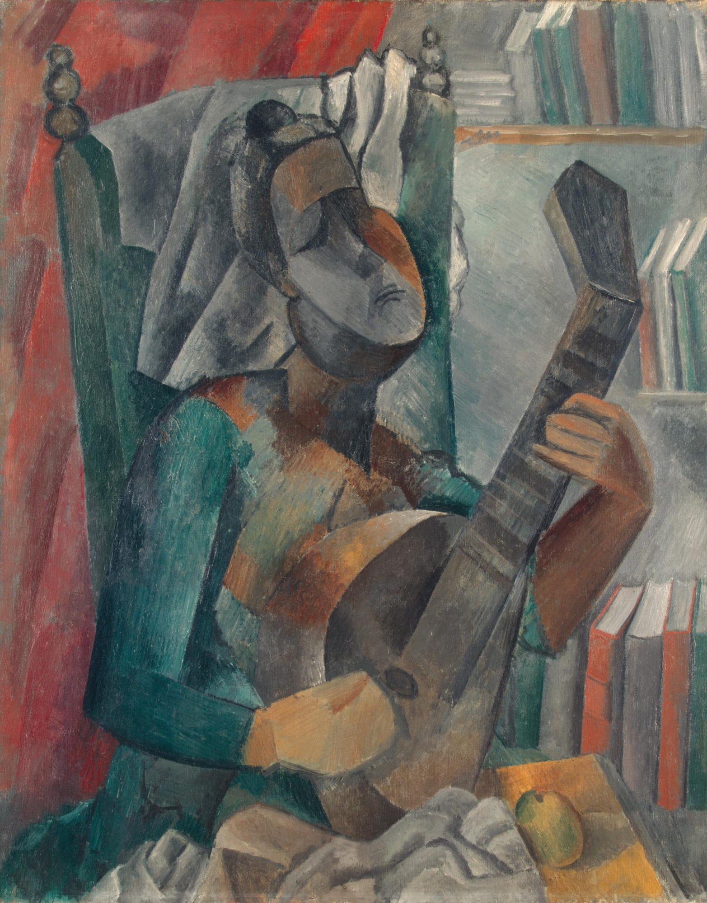
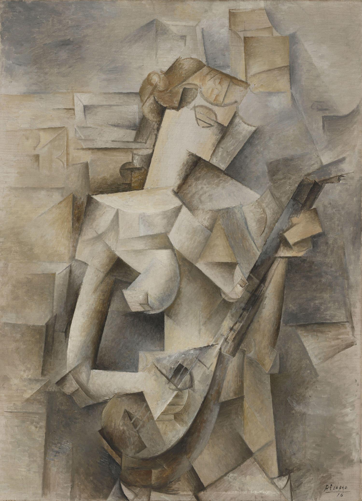

## 基本信息

- 作者：[[毕加索 Pablo Picasso]]
- 创作年代：1909
- 材质：油彩，画布 (*not from wiki*)
- 尺寸：(*not from wiki*) 约 91 × 72.5 cm
- 现存地：(*not from wiki*) 圣彼得堡冬宫博物馆 (State Hermitage Museum)

## 画面与技法

[[黑人时期 African Period (Picasso)|黑人时期]] **晚期**代表作——已经处在向 [[立体主义 Cubism|分析立体主义]] 过渡的临界点：女人和曼陀铃被切成**棱角分明的几何切面**，体块的边缘开始模糊地"漏到"背景里——这种**形与底渗透**的趋势，下一阶段会在 [[066｜毕加索3：什么是分析立体主义？|分析立体主义]] 中完全爆发。

顾衡此处把它归入"打着塞尚旗号画非洲木雕"——但相比《[[友谊 Friendship (Picasso)|友谊]]》《[[三个裸女 Three Women (Picasso)|三个裸女]]》，本作已经更"分析"、更几何，非洲木雕的味道减弱。

## 历史背景 (*not from wiki*)

- 1909 年夏天毕加索在 Horta de Sant Joan 度假后回巴黎所作；这一段乡村度假期他与 [[勃拉克 Georges Braque]] 频繁通信——分析立体主义的雏形正在两人间形成。
- 同样由 Sergei Shchukin 收购，今藏冬宫。

## 图片清单

| 编号 | 出自 | 描述 |
|---|---|---|
| 01 | [[065｜毕加索2：如何理解"黑人时期"？]] | 全图——黑人时期晚期、向分析立体主义过渡 |

## 出现在

- [[065｜毕加索2：如何理解"黑人时期"？]] —— [[黑人时期 African Period (Picasso)|黑人时期]] 晚期代表作
