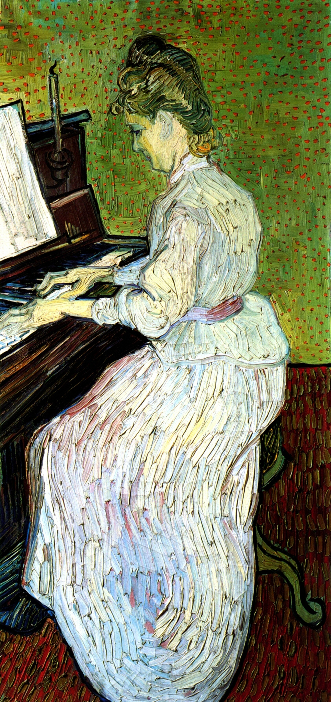

## 基本信息

- **作者**：[[凡·高 Vincent van Gogh]]
- **创作年代**：1890
- **材质**：(*not from wiki*) 布面油画
- **尺寸**：(*not from wiki*) 102.6 × 50 cm
- **现存地**：(*not from wiki*) 巴塞尔艺术博物馆 (Kunstmuseum Basel)
- **模特**：(*not from wiki*) 玛格丽特·加歇 (Marguerite Gachet)，凡·高在奥维尔最后阶段的医生加歇大夫之女

## 画面与技法

凡·高**"被新印象主义忽悠"**时期的样本（顾衡 047）——文化程度不高、性格偏执、给弟弟提奥写信兴奋地说"**至于点彩画法，我认为它是真正的发明**"。

但**凡高没有修拉的耐心**（修拉点《[[大碗岛的星期天下午 A Sunday Afternoon on the Island of La Grande Jatte]]》光是点小点点就点了一年多），凡高就走捷径："**只是在画好的画上随便点些小红点**"——结果（顾衡的损话）：

> "**人家好好个姑娘跟得了天花似的**"

凡·高坚持自称"我也是新印象主义、是科学的点彩派"——新印象主义主将 [[西涅克 Paul Signac]] 哭笑不得，亲口劝退：

> "**求求你，可千万别再跟别人说你也是新印象主义哈。**"

## 与"真正的点彩"的对比

| | 真正的点彩（修拉） | 凡·高《弹钢琴的女人》 |
|---|---|---|
| 小点子角色 | **构成画面唯一笔触单元** | **画好之后随便点些红点** |
| 大小与间距 | 大小相等、间距相等 | 不规则 |
| 颜色选择 | 预先 22 色色轮 + 强度值计算 | 主观即兴 |
| 视觉效果 | 视觉混和成预定色彩 | "**人家好好个姑娘跟得了天花似的**" |

## 历史背景 *(not from wiki)*

- 1890 年 5 月凡·高离开圣雷米精神病院，住到巴黎北郊奥维尔小镇，由加歇医生看护
- 这幅画在凡·高生命最后 70 天内完成，模特是加歇大夫的女儿玛格丽特·加歇
- 1890 年 7 月凡·高自杀身亡——这是他最后阶段的肖像作之一

## 图片清单

| 编号 | 出自 | 描述 |
|---|---|---|
| 01 | [[047｜修拉：新印象主义为什么走进了死胡同？]] | 整幅画作 |

## 出现在

- [[047｜修拉：新印象主义为什么走进了死胡同？]] —— 凡·高被点彩派"忽悠"的反例样本
