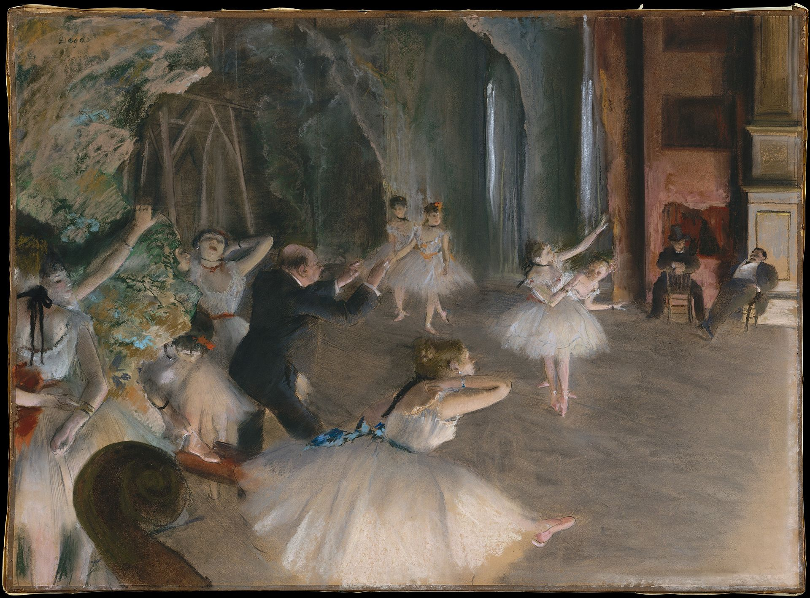

## 基本信息

- 作者：[[德加 Edgar Degas]]
- 创作年代：1878
- 材质：粉彩与水粉 / 单刻版画 (*not from wiki*)
- 尺寸：(*not from wiki*)
- 现存地：(*not from wiki*) 纽约大都会艺术博物馆 Metropolitan Museum of Art

## 画面与技法

舞台上正在彩排的群像——**对角线构图** + **前景双弓步舞女**——典型德加 **照相机抓拍式** 取景，乐池中的舞蹈大师与提琴谱架点缀左下角。

045 顾衡明示：德加专挑女演员"最放松、最自然的状态"画——这是为了让她们的线条"与古代大师形成有效沟通"——**舞台表演效果反而是要被刻意回避的**。

## 历史背景

(*not from wiki*) 1878 年是德加在巴黎歌剧院演出彩排区域有特殊出入权限的时期——他亲自蹲守剧院后台速写多年。

## 图片清单

| 编号 | 出自 | 描述 |
|---|---|---|
| 01 | [[045｜德加：为什么印象派以他结束？]] | 舞台上彩排的舞女与乐师 |

## 出现在

- [[045｜德加：为什么印象派以他结束？]]
