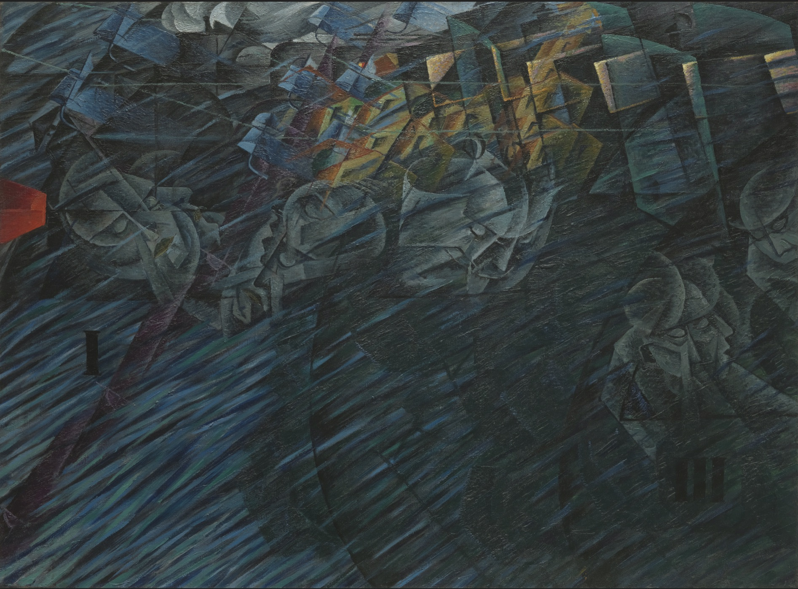

## 基本信息

- 作者：[[波丘尼 Umberto Boccioni]]
- 创作年代：1911
- 材质：布面油画 (*not from wiki*)
- 尺寸：约 70 × 96 cm (*not from wiki*)
- 现存地：纽约现代艺术博物馆 (MoMA) (*not from wiki*)

## 画面与技法

[[未来主义 Futurism]] 三联画《心境》（Stati d'animo）的第二幅，画**离站列车上乘客的内心震荡**——斜向贯穿的运动线条 + 几何分块表达机器力对人形的撕扯。

## 历史背景

(*not from wiki*) 三联画的中段。与 [[心境：告别 States of Mind The Farewells]] 同期 1911。

## 图片清单

| 编号 | 出自 | 描述 |
|---|---|---|
| 01 | [[080｜什么是未来主义？]] | 整体图 |

## 出现在

- [[080｜什么是未来主义？]]
