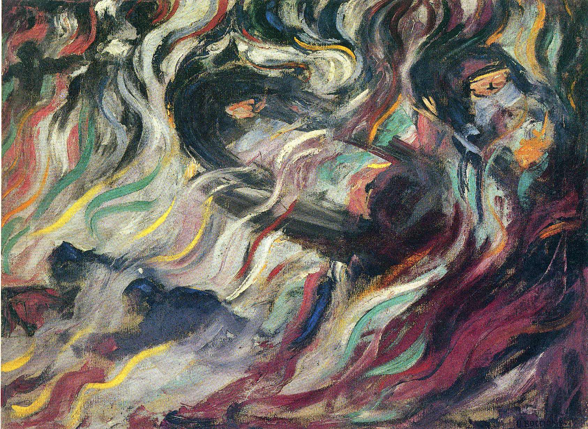

## 基本信息

- 作者：[[波丘尼 Umberto Boccioni]]
- 创作年代：1911
- 材质：布面油画 (*not from wiki*)
- 尺寸：约 70 × 96 cm (*not from wiki*)
- 现存地：纽约现代艺术博物馆 (MoMA) (*not from wiki*)

## 画面与技法

[[未来主义 Futurism]] 三联画《心境》（Stati d'animo）的第一幅，描绘火车站台告别场景中机械力量、烟雾、号码与人形相互穿插——把 [[立体主义 Cubism]] 的几何分块拿来表现"机器感 + 运动 + 情绪"。

## 历史背景

(*not from wiki*) 三联画《心境》（《告别》、《去的人》、《留下的人》）是波丘尼最重要的未来主义实验之一，1911 年完成，曾于 1912 年巴黎伯恩海姆-热纳画廊未来主义首次大型展览展出。

## 图片清单

| 编号 | 出自 | 描述 |
|---|---|---|
| 01 | [[080｜什么是未来主义？]] | 整体图 |

## 出现在

- [[080｜什么是未来主义？]]
