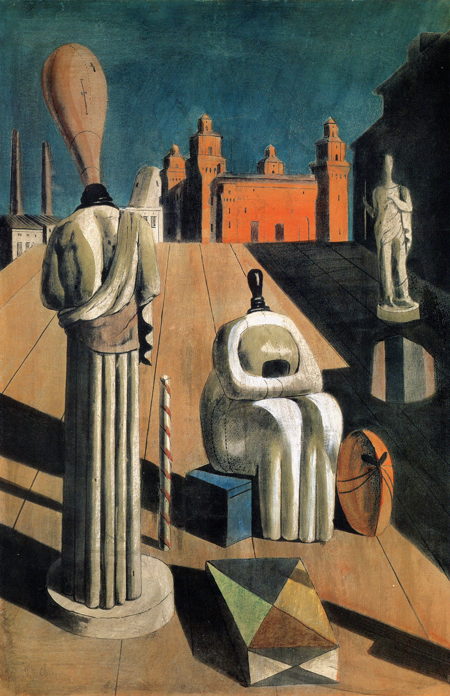

## 基本信息

- 作者：[[契里柯 Giorgio de Chirico]]
- 创作年代：1916（契里柯有多个版本与复制；本课所示为 1916 年起的原版/早期版本）(*not from wiki*)
- 材质：布面油画 (*not from wiki*)
- 现存地：私人收藏（多个版本存世） (*not from wiki*)

## 画面与技法

[[形而上画派 Metaphysical Painting]] 经典作。除了惯用的**大广场和长阴影**外，契里柯在本作里引入了一个新概念——"**错置 (displacement)**"：

- **把本应出现在橱窗里的服装模型搬到广场中来**
- 一个**拱手而立**，一个**环手而坐**

**单看这两个缪斯**，神态都很安详、岁月静好。**可是和周围环境一匹配**，再加上长长的阴影——这两个缪斯立即变成**广场恐惧症患者**，强忍着内心的恐惧在故作镇静。

这种"错置"手法此后被 [[超现实主义 Surrealism]] 梦境派（达利、马格利特等）大量吸收 (*not from wiki*)。

## 图片清单

| 编号 | 出自 | 描述 |
|---|---|---|
| 01 | [[093｜契里柯与恩斯特：如何用绘画表现超现实主义？]] | 广场前景两个无脸服装模特（一立一坐），远端是工厂烟囱与红砖建筑，地面铺木板透视 |

## 出现在

- [[093｜契里柯与恩斯特：如何用绘画表现超现实主义？]] — "错置"概念的典型作品
